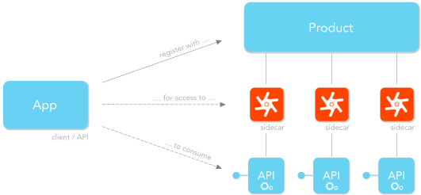

# TetraPak.AspNet.Api

## This document

This document provides the big picture of how to use this SDK while creating or consuming APIs, while introducing some important concepts and code APIs. If this is the first few times you are using the SDK then this is a great place to start. But depending on your background you might also consider starting elsewhere:

If you are somewhat new to ASP.NET Core/5+ web app development then it might be a good idea first check out the [ASP.NET Core/5+ Project Overview][overview-aspnet-webapp] and then come back here.

If you are a seasoned ASP.NET Core/5+ developer and just want to quickly integrate your web app (or API) with Tetra Pak's Auth Services then you can either just skip ahead to the [cheat cheat][cheat-sheet-tetra-pak-aspnet-api] or try [this recipe][tetra-pak-aspnet-api-recipe] for a step-by-step walk through, with some explanations, on how to build a Tetra Pak API.

Also, if you are already familiar with the SDK but you are facing issues or scenarios you are unsure of how to resolve then it might be a good idea to check out [this document][tetra-pak-aspnet-scenarios] 

However, if you want some more background or need a better understanding; then please continue.

## Overview

The TetraPak.AspNet libraries are provided as a way to get more productive when writing web-based solutions that integrate with Tetra Pak's landscape. It includes code APIs and helpers for typical C3 (cross-cutting concerns) such as authorization, authentication, logging, debugging, diagnostics, and so on. 

The [TetraPak.AspNet.Api Nuget package][nuget-tetra-pak-api] is built on top of the [TetraPak.AspNet Nuget package][nuget-tetra-pak-app] to provide tools and solutions for the special needs you face when building an API. This also makes it convenient when you find you are writing a web app but also have a need for an "integrated" API, especially when writing a lot of client side JavaScript that needs to read and write data asynchronously, such as with SPA's (Single Page Applications). Whenever you need to build an API; just add the [TetraPak.AspNet.Api Nuget package][nuget-tetra-pak-api] and you'll have access to the full SDK!

## Writing APIs 

One very important aspect with Tetra Pak API development is how you:
- Design URLs paths, formats and conventions for a pleasant client developer experience
- Need to consider how the API gets managed

As a developer writing clients for APIs you will likely have experienced the varying quality of APIs. One API might be very well designed, with consistent URL/path design, data formats, and conventions. Other APIs appear as if they had been written by a committee of developers that didn't agree on anything. The result is a very poor experience where the code you write to consume one API endpoint is useless as you move on to consume another, even though they are offered by the same API. As a consequence you need write almost (but not quite) the same code over and over, often with scores of if-else clauses to deal with the inconsistencies and exceptions to (what should have been) rules, like in this example ... 

```c#
if (data.ContainsField("first-name"))
{
    user.FirstName = data["first-name"];
}
else if (data.ContainsField("first_name"))
{
    user.FirstName = data["first_name"];
}
else if (data.ContainsField("firstName"))
{
    user.FirstName = data["firstName"];
}
:
```

... or this one ...

```c#
HttpClient getClient(string path)
{
    return path switch
    {
        // configure client with different headers and authorization ... 
        "/orders" => getClientForOrders(),
        "/products" => getClientForProducts(),
        "/invoices" => getClientForInvoices(),
        : // ... abd so on ...
        _ => throw new NotSupportedException($"Cannot create client for path: {path}")
    };
}
```

Badly designed APIs makes for a miserable client developer experience. Not only will it yield frustration and even cursing, or the need for regular coffee brakes; it would actually mean your clients lose time and money! Having to deal with hundreds of little inconsistencies will render any investments, such as reusable code components for your API, pointless. As your client devs stumble upon one inconsistency after another they quickly realize there will probably never be enough if-else's or switch-clauses anyway to cover constantly changing formats and conventions. It's like trying to hit a moving target! This will cause them to try and avoid your API and look for a way to work around it.
 
This SDK contains classes and convenience methods that will help you stay consistent, and to make your API automatically adhere to [Tetra Pak's API Guidelines][guidelines-tetra-pak], such as sending data or errors back in one consistent format (see -- TODO {`link to ControllerBaseExtensions.RespondAsync extension method`} -- ).

## API Management

Another aspect that sets Tetra Pak API development apart from writing web applications is the fact you need it to be *managed* by Tetra Pak. A *managed* API is one registered with Tetra Pak and that is protected by a reverse proxy, also known as the API's [*sidecar*][sidecar]. The Tetra Pak API management system also knows exactly who to trust as clients of that API, to ensure not just anyone can consume it! 

The [*sidecar*][sidecar] works as single entry/exit point for all traffic to/from its API and helps protecting the API itself from malicious- or over use. The [*sidecar*][sidecar] can also apply various Tetra Pak policies, collect telemetry or even manage access for users that pay for that access at different tiers. While it can't brew coffee or keep your socks in order it *can* (and will) relieve you from a long list of cross-cutting concerns (a.k.a. "C3") you would otherwise have to understand and implement solutions for!

Every Tetra Pak-managed API is protected by its [*sidecar*][sidecar]. This goes for all levels of the landscape. As an API developer you often find you need to consume other APIs, which means you will be "talking" to them indirectly through *their [sidecars][sidecar]*, and so on. Each [*sidecar*][sidecar] is communicating with the Tetra Pak Auth Services ("TPAS" for short), when authorizing (or rejecting) incoming traffic to its API.

### App registration

As you start building managed Tetra Pak APIs you will need to communicate with colleagues that provide API management and that can supply services for your project. When you collaborate with these colleagues it's always a good thing if you share the same "mental image" and know the meaning of the specialized API management terms used. 



Every client that needs to consume a Tetra Pak API needs to register itself to be recognized and "trusted" by TPAS. This is done using the [Tetra Pak Developer Portal][tetra-pak-dev-portal] and will create an internal "client identity", (and a "client secret", among other details). This also makes it possible for Tetra Pak to vet the client registration and either approve or reject (revoke) it if needed, adding another layer of control and security for Tetra Pak.

When registering the client the developer specifies which API "products" the client needs access to. Every API product covers one or more APIs, which is managed by their individual [*sidecars*][sidecar] (see above image).

Of course, each of the APIs also needs to be recognized by TPAS. Some of them will also need to consume other API, effectively making them clients of those APIs. This somewhat blurs the line between a *client* and *API* so TPAS just calls these registrations "*apps*", or "*app registrations*". 

### How API traffic is managed

Now that we know the terms involved with API management; how is this management actually working? As some client makes a request to an API (via its [*sidecar*][sidecar]); how can TPAS manage it, and ensure no unauthorized requests are successfully made by "rouge" clients?


Let's try to understand the traffic flow of managed APIs by telling a somewhat childish story of "the request" ...

Look at the above graphic and imagine a request made by a client, on behalf of a human user - "Anna". We'll keep it very simplified (bordering silly, actually) and walk through all the requests, marked "a" through "j", just to create some initial understanding. 

Let's say Anna has just browsed to "Client X", a web application that is registered as a client in TPAS to consume "API 1". 

- `(a)` `Client X` first needs to get authorized for acting on Anna's behalf so it sends a request to TPAS for an access token, basically saying "*I'm Client X and I need some data from `API 1` on Anna's behalf. Oh, and I also need some details from Anna's profile: her (first/last) name and email address*". As part of that request `Client X` identifies itself, using its "*client id*". As it needs to act on behalf of a human (`Anna`) she will have to be authenticated, forcing her to submit her username and password. Now, `Anna`'s secret password should only be "known" by Anna so it is important `Client X` cannot see it. Also, if this is the first time `Anna` uses `Client X`, TPAS will need Anna's concent for supplying her profile details to `Client X`. This flow is quite complex amd involves a lot of redirecting back and forth between a browser and various TPAS endpoints (see [OAuth Code Grant for details][oauth-code-grant]). The flow is designed to keep `Client X` ignorant regarding `Anna`'s secret password.

- `(a)` TPAS checks to ensure `Client X` is indeed a trusted client of `API 1`. Turns out it is so TPAS issues an *access token* (a.k.a. *security token*) and sends it back to `Client X`, to be used when sending requests to `API 1`. This token (marked "1") is "*opaque*", which simply means its content bears no discernible information to the client. For all `Client X` cares it's just a random string.

- `(b)` `Client X` now sends its request to `API 1` via its [*sidecar*][sidecar] with the access token `(1)` attached to a request header.
  
- `(c)` The [*sidecar*][sidecar] sends the token `(1)` attached to a message to TPAS, asking: "*is this a legit access token, issued by you guys to `Client X` to act on behalf of Anna, asking `API 1` for stuff?*" .  

- `(c)` TPAS checks its records and sees that the access token `(1)` was indeed issued to `Client X`, on behalf of `Anna`. This token `(1)` has now served its purpose and cannot be used furter "*downstream*" (to the right in the diagram). Instead, to authorize [*sidecar*][sidecar] to make requests to `API 1`, TPAS now issues a new, private, token to be used for this purpose only. This token has a very short "*lifespan*" ("*TTL*" = "*time to live*"), to minimize the risk if someone managed to pick it up somehow. Also, the token is of type ["JWT" (look it up)][jwt-io] which serves a double purpose: Firstly to authorizing [*sidecar*][sidecar] (as mentioned) and, secondly, to carry `Anna`'s identity (name, email etc.). This is often needed by the API anyway so it's a great way to keep the number of requests low. 

  > A neat feature with the [JWT][jwt-io] (unlike other access tokens) is that TPAS signs it, using a private key. This makes it possible for anyone to asserts its validity. All that is needed is TPAS's public keys, which are publicly available from a "well-known" TPAS endpoint.

- `(d)` The [*sidecar*][sidecar] now passes the request along to `API 1`, including the private [JWT][jwt-io] `(2)`. 

- `(e)` As the request (finally) reaches `API 1`, it needs to be validated, yet again, to assert it wasn't "self-made" by some rogue client! `API 1` therefore downloads TPAS (publicly available) cryptographic keys and "unlocks" the [JWT][jwt-io] to assert it is a legit token, issued by TPAS, on behalf of `Anna`. The [JWT][jwt-io] is also tagged to only allow use for a specified client (`Client X`). This is called the token's "*audience*". 

- `(f)` Assured no one is pulling its proverbial leg, `API 1`'s starts processing the request (finally) but immediately realizes it needs some additional data to construct the response. That data can be provided by `API 2` which requires a *downstream* request to that API. As I'm sure you've guessed, just making that request wouldn't work! Nope, `API 1` must first be authorized and get its own access token for `API 2` consumption. So, `API 1` goes: "*hey, TPAS, can I get some stuff from `API 2`, on behalf of Anna, via `Client X`?". In that message `API 1` embeds the [JWT][jwt-io] it got from its *sidecar* to authenticate the request.  

- `(f)` TPAS (which never have time for tea and biscuits!) checks its app registration records to see of `API 1` is a trusted client of `API 2`. Turns out it is so TPAS now issues an access token `(3)` for `API 1`-to-`API 2` requests, on behalf on Anna. 

- `(g)` Using its `API 2` access token `(3)`, `API 1` requests the needed data from `API 2` via its [*sidecar*][sidecar]. The whole process of validating tokens, authorizing clients and minting more tokens gets repeated (requests `h`, `i` and `j`, producing another private [JWT][jwt-io] - `4`). You probably get the picture by now so let's just say that there's a happy ending where `API 2` serves up the data to `API 1` which is now able to successfully construct and send the requested response back to `Client X`, and `Anna` (which lived happy ever after!).

While this short story might have been a wee bit childish it should have given you some insight into what it means to be writing a managed Tetra Pak API!

There is quite alot of asserting and obtaining necessary authorization that needs to happen. Also, what wasn't apparent in this happy story is all the (sad) alternative paths, where tokens have expired or where you realize you need some way to securely cache valid tokens or suffer from bad performance if you constantly keeps calling TPAS, even for tokens that doesn't need replacement. Then there's the need to track these things in logs, to allow diagnosing what went wrong. And so on.

To do all this you need a good understanding of all the auth flow details and also quite a lot of technical information about the Tetra Pak Auth Services, depending on which runtime environment you are targeting (Development, Migration or Production). 

Writing APIs can be quite involved and require skills and knowledge that covers not only complex auth flows but also the current Tetra Pak security recommendations. This SDK is here to relieve you from most of those problems so you can focus on provinding the good stuff to your consumers. Meanwhile, the Tetra Pak ASP.NET API SDK "*protects what's*" good! ;-)


[overview-aspnet-webapp]: ../TetraPak.AspNet/_docs/aspnet_webapp_overview.md
[cheat-sheet-tetra-pak-aspnet-api]: ./_docs/cheatsheet-webapi.md
[recipe-tetra-pak-aspnet-api]: ./_docs/cheatsheet-webapi.md
[recipe-tetra-pak-aspnet]: ../TetraPak.AspNet/_docs/Recipe-WebApp.md
[tetra-pak-aspnet-scenarios]: ../Scenarios.md
[tetra-pak-dev-portal]: https://developer.tetrapak.com
[nuget-tetra-pak-app]: https://www.nuget.org/packages/TetraPak.AspNet
[nuget-tetra-pak-api]: https://www.nuget.org/packages/TetraPak.AspNet.Api
[guidelines-tetra-pak]: https://developer.tetrapak.com/products/api-design
[oauth-code-grant]: https://www.oauth.com/oauth2-servers/server-side-apps/authorization-code/
[jwt-io]: https://jwt.io/
[sidecar]: https://docs.microsoft.com/en-us/azure/architecture/patterns/sidecar