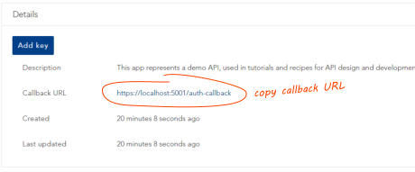

# Recipe: Create a Tetra Pak API

This document will walk you through creating a small API and integrate it with the Tetra Pak Auth Services. After completion you should have a good understanding of how to integrate an existing API as well. 

>If you need an overview and some background then please check out the [README document][tetra-pak-aspnet-api-readme]. If you already know everything and just need the fast-track to integrating your existing API then there is also a neat [cheat sheet][tetra-pak-aspnet-api-cheat-sheet] (yes, that rhymes :-). Finally, for many issues there is a small ["scenarios" document][tetra-pak-aspnet-scenarios] that might help you out.

The API will be built with ASP.NET Core/5+ and consist of a single "hello" controller with two endpoints: One default `/hello` endpoint that will return a message saying "Hello", followed by the name of the user, and a `hello/version` endpoint that will return the API version (taken from the running assembly metadata). 

To resolve the identity of the caller the first endpoint (`/hello`) requires actor* authentication, which is why the API needs to be integrated with the Tetra Pak Auth Services (identity provider)! The second (`hello/version`) endpoint should be publicly available and will therefore not require authentication.

> \* ***Actor*** 
> 
> *We use the term* `actor` *for "the party ultimately initiating a request". This can be a human or some autonomous service. The actor must be recognized as an* `identity` *by the Tetra Pak Auth Services (TPAS)*

## Ingredients

To complete this recipe you will need:

- Access to the [Tetra Pak Development Portal][tetra-pak-dev-test-portal]. Please ensure your computer have access to the Tetra Pak network, directly or though a VPN
- A development environment (IDE). You can use whichever tool you prefer, such as [Visual Studio][ide-vs], [VS Code][ide-vscode], [Rider][ide-rider], or any other tool. Those mentioned have good .NET support but the choice is yours.
- A tool to make request to your API, for testing. We till use [Postman][postman] for this but you are can use a different tool if you prefer.

## Disclaimer

This recipe assumes you know how to write, run, and debug C# using your preferred IDE (Integrated Development Environment) be it [Visual Studio][ide-vs], [VS Code][ide-vscode], [Rider][ide-rider], [Eclipse][ide-eclipse] etc. We will not cover the exact how-to of each step required, such as creating a new project, add/restore Nuget packages and so on. As these details differs from one IDE to the next you are expected to know the required steps.

## Overview 

Before we start the detailed walk-through, let's first get an overview of the steps required to create and integrate a Tetra Pak API. In a real-life project there are, at the time of this writing*, a few steps where you need a favor from a Tetra Pak "API manager"; someone with access to Tetra Pak's API Management System ([Apigee][apigee]**), and that knows how to use it. But for the sake of this recipe you can get around this by using pre-configured demo resources.

> \* *The API innovation team strives to provide tools and services to make developers as autonomous as possible but as of now some steps needs to be vetted and approved manually.*
> 
> \** [Apigee][apigee] *is a product used to manage all Tetra Pak APIs*

1. [**Register the API with Tetra Pak**](#register-the-api-with-tetra-pak)
  
   Before we can integrate the API with TPAS we need to first register it as an `app`* with Tetra Pak. In this step we'll browse over to the [Tetra Pak Development Portal][tetra-pak-dev-test-portal] and see how that is done. We will need some information, such as the *client id*, from this step. This (and the successive [**Create a *sidecar***](#create-a-sidecar)) step reflects what's needed in an actual project but you can opt to skip them and instead use a pre-configured app registration.

   > \* *An `app registration` is how TPAS "knows" about your API. But clients of APIs also needs to be recognized and, often, your API needs to consume other APIs, effectively making it both an API and a client. We just use the term "app registration" or "app" for sake of simplicity.*
  
2. [**Create a *sidecar***](#create-a-sidecar)
  
   Your API will be managed and protected by its [*sidecar*][sidecar] (deployed with [Apigee][apigee]) so we need one set up for us, by a tetra Pak API manager. This step can be skipped 

3. [**Register a client for testing**](#register-a-client-with-tetra-pak)

   When we're done we need to test the API. For this we need a registered "app", set up to be a trusted client of our new API. This is also done from the [Tetra Pak Development Portal][tetra-pak-dev-test-portal] but, again, we also need the help from an "Apigee resource" to configure the *client* to be "trusted" by the API. For the sake of this recipe we will rely on a pre-made client app registration to avoid lead times.

4. [**Create the API project**](#create-the-api-project)
  
   Your preferred development tools (IDE) will (probably) offer some sort of [project scaffolding](https://en.wikipedia.org/wiki/Scaffold_(programming)) where you pick a suitable project template, choose authorization mechanism, maybe add Git integration, and so on. The way this is done differs, quite a lot, from one IDE to another so this recipe will only offer general guidance. You're expected to know your tool!

5. [**Add SDK Nuget package**](#add-sdk-nuget-package)
  
   This step is where you add the SDK support and should be very straight-forward but, again, there will be no detailed steps as this is also done differently from one IDE to another.

6. [**Write business logic**](#write-the-business-logic)
  
   We write the controller and the two endpoints (`/hello` and `/hello/version`). In a real-life project you would probably start writing the business logic *after* having integrated your API with TPAS but for sake of "flow" we'll do it before the integration step, coming up next.

7. [**Integrate with TPAS**](#integrating-with-tetra-pak-auth-services)
  
   This is where we write the code and add the necessary configuration to integrate with TPAS and set your API up to be function behind its [*sidecar*][sidecar]. We'll need the *client id* from the previous steps to complete this.

8. [**Test the API**](#test-the-api)
  
   We register a client "app" and make test requests for the two endpoints, using [Postman][postman].

So, with the plan firmly set in our mind, let's get going...

## Register the API with Tetra Pak

 >This step of the recipe will demonstrate how to register an "app" with Tetra Pak. This is so you can do it yourself in your projects. After registering you would then need the assistance of an "API manager" - a Tetra Pak resource with access and know-how to configure your registered app and create a [*sidecar*][sidecar] for it. 
 >
 > For the sake of this recipe you can instead rely on a pre-configured app registration, to avoid the lead time from having to reach out and wait for your registration to be configured and ready for use. Read through the following steps if you want to understand how to register your API "app", or skip this section and move on to ["Get the *demo* API details"](#get-the-demo-api-details)    

 For any app to integrate with the Tetra Pak Auth Services it needs to be recognized by Tetra Pak. This is done by simply registering the app, with a name and unique "consumer key" (a.k.a. "client id" or "API key"). You do this in the Tetra Pak Developer Portal like so:

1. Open a browser and navigate to the [Tetra Pak developer portal][tetra-pak-dev-test-portal]

   >This instruction assumes you are starting out with a DEV (Development) environment. For PROD (Production) please use the [Production development portal][tetra-pak-dev-portal].

2. Log in
   
3. Click the "Apps" menu item at the top of the page
   
4. Click the "Add app" command (upper left part of page)
   
5. Give your app a name and supply a short description of it
   
6. Specify the Callback URL (from [this step](#save-local-url)). The default callback path for this SDK is `/auth-callback`. So, for example, if your local host is `https://localhost:8080` then the Callback URL should be `https://localhost:8080/auth-callback`

   > Please note that this value can be edited later if you return to your app registration and select the "Edit" tab (will be visible once you save your app registration). If you are unsure at this time which port you'll be using locally then just change this value later, when you know the full callback URL. [For more information please go here][tetra-pak-dev-portal-appreg-callback].

7. In a "real" web app you would probably want to consume one or more API products. For this recipe that is not the case. However, please double check that the "`Enterprise Application Security`" service is already selected, or select it otherwise. This service is critical for integrating with the Tetra Pak Auth Services. You might have to scroll down to see it

8. Click "ADD APP" (bottom of the web page)
   
9. You are now presented with your app overview page, where all your app registrations are listed. Please select the one you just created by clicking it. This should present the App details
    
10.  In a [later step](#get-the-demo-api-details) we are going to need the `client id` (called a "consumer key" in the developer portal). We'll get back to that.

## Create a *sidecar*

All Tetra Pak APIs must be managed, meaning they must be running "behind" a [*sidecar*][sidecar] (a managed reverse proxy). Getting a [*sidecar*][sidecar] set up and configured is unfortunately (at the time of this writing) not something you can do yourself. Instead, your project should have one assigned "*Apigee resource*" that you need to turn to to get this done. Usually, it's a fairly quick process but you need to reach out to get this done. In doing so you also need to get this information back:

1. You will have to agree on an "*audience*" for the [JWT Bearer Assertion][tetra-pak-aspnet-api-jwt-bearer-assertion] flow to work. This is simply a name (or "*identifier*") to be used by your [*sidecar*][sidecar]. Negotiate a suitable audience identifier for your API with the *Apigee resource*.
   
2. If you plan to consume other services (APIs) from your API, you need to mention this requirement. This will affect how your sidecar gets configured. This is not needed for this recipe (see the [next API recipe][tetra-pak-aspnet-api-recipe-2] for an example of an API that consumes another API)
   
3. Ask the *Apigee resource* to add the ability for a "*Developer Proxy*". This is so you can run and debug your API locally. If that was unclear; don't worry. We'll get back to this shortly. Just read on. 
   
4. When you get the `sidecar name` and `audience`, note them down for later.

## Get the demo API details

As an alternative to creating your own API app registration and wait for an "API manager" to configure it for you, as well as deploying your API's [*sidecar*][sidecar], you can use a pre-configured app registration that's been set up and supplied for the sake of demonstration. 

1. Browse to the [Tetra Pak developer portal][tetra-pak-dev-test-portal].
   
2. Click the "Apps" menu item at the top of the home page.

3. If you prefer the pre-configured app registration; look up the "`demo_hello_api`". If you registered your own app (and got it configured) the look for that instead. Either way; click the app's entry to expand it. THis will give you the details we're looking for.
   
4. Copy the "consumer key" by clicking this icon on that line: 
   
    

5. Copy the "callback URL": 
   
   

## Create the API project

For sake of convenience the project will be called "TetraPakHelloApiRecipe".

1. Create a ASP.NET Web API project, name it "`TetraPakHelloApiRecipe`". Please pick a suitable project template. 
   
   > If your IDE project templates present you with the option to add "Auth" or "Authentication" in some way, please opt out. We will add authentication manually later in this recipe as it's pretty simple anyway.
   > Also, the project template wizard (if your IDE supports one) might offer a web appliction *type*, such as MVC Razor, Blazor or API and so on. If possible select the API option (avoid Blazor  -this SDK doesn't support it yet!).

2. The recipe assumes the default controller is called `HelloController`. If the project scaffolded some default controller for you; just rename it and remove all the code, or delete the class file and create an empty `HelloController` instead class under the "Controllers" folder (create the folder if necessary).

   This is what the folder/file structure should look like as a minimum (your IDE's project template might have added more files and folders - that's ok). If these files and folders wasn't created by your IDE then please create them:

    ```
    +-- TetraPakApi
        |
        +-- Controllers
        |   |
        |   +-- HelloController.cs
        |
        +-- appsettings.js
        +-- Program.cs
        +-- Startup.cs
    ```

## Add SDK Nuget package

Before we start coding you first need to add the SDK's Nuget package [TetraPak.AspNet.Api][nuget-tetrapak-api] as there will be one or two extension methods in our code that requires it. The way you add Nuget packages to you project differs from one IDE to another so we won't cover that in detail. Add the [TetraPak.AspNet.Api][nuget-tetrapak-api] now.

## Write the business logic

Lets look at the contents of each file, starting with the `HelloController` class and work our way down:

```c#
// ./Controllers/HelloController.cs

using System.Runtime.CompilerServices;
using System.Threading.Tasks;
using Microsoft.AspNetCore.Authorization;
using Microsoft.AspNetCore.Mvc;
using Microsoft.Extensions.Logging;
using TetraPak;
using TetraPak.AspNet;
using TetraPak.AspNet.Api.Controllers;
using TetraPak.Logging;

namespace TetraPakHelloApiRecipe.Controllers
{
    [ApiController]
    [Route("[controller]")]
    [Authorize]
    public class HelloController : ControllerBase
    {
        readonly ILogger<HelloController> _logger;

        [HttpGet]
        public Task<ActionResult> Get()
        {
            logRequest();
            var actorName = User?.FirstName() ?? "stranger";
            var outcome = Outcome<object>.Success(new
            {
                Message = $"Hello {actorName}!"
            });
            return this.RespondAsync(outcome);
        }

        [AllowAnonymous]
        [HttpGet, Route("version")]
        public Task<ActionResult> GetVersion()
        {
            logRequest();
            var data = new { Version = typeof(Startup).Assembly.GetName().Version?.ToString() ?? "(unknown)" };
            return this.RespondAsync(Outcome<object>.Success(data));
        }

        void logRequest([CallerMemberName] string endpoint = null)
        {
            _logger.Trace($"{User.FirstName()} {User.LastName()} called {endpoint}");
        }

        public HelloController(ILogger<HelloController> logger)
        {
            _logger = logger;
        }
    }
}
```

The controller is decorated with the `[Authorize]` attribute, meaning all endpoints will require the actor to be authenticated.

To allow logging the controller constructor (ctor) accepts a logger provider (`ILogger<HelloController>`) which is stored in a private `readonly` field -  `_logger`. Please note that this logger provider is automatically injected by ASP.NET's dependency injection mechanism as the controller gets instantiated. The controller declares a convenient private method - `logRequest()` - that will simply trace the actors identity (first and last name) along with the endpoint method name.

> This is just to show some convenient extension methods for logging and getting the actor's identity (first and last name). If you actually want a good trace of all requests, including the request URL, headers and, possibly, body, there are better methods to do so but that's beyond the scope of this recipe.

The default endpoint is just decorated with the `[HttpGet]` attribute, making it the default endpoint for this controller: `/hello`. Let's look at its content:

```c#
[HttpGet]
public Task<ActionResult> Get()
{
    logRequest();
    var actorName = User?.FirstName() ?? "stranger";
    var outcome = Outcome<object>.Success(new
    {
        Message = $"Hello {actorName}!"
    });
    return this.RespondAsync(outcome);
}
```

The `logRequest()` has already been explained so lets instead examine how the response is being constructed: 

We're creating a generic [outcome][md-Outcome-T], passing an anonymous object as it's value. The anonymous object contains a single attribute: `Message`. If we where to just return this anonymous object as the response (using `return Ok(new {Message = $"Hello {actorName}"}`) the response would simply be its JSON serialized form: 

```json
{
  "message": "Hello Anna!"
}
```

That might be fine but we're striving a bit higher than that. As mentioned in the ["Writing APIs section" of README][tetra-pak-aspnet-api-readme-jwt-writing-apis] we want this API to be consistent in its response format and we also want to adhere to Tetra Pak's API guidelines, encouraging our clients to invest in code components when consuming different Tetra Pak APIs. In short; this is going to be a Tetra Pak business API! 

> **Tetra Pak business API**
>
> What that means is it should be a reusable "general purpose" API. To make an API "reusable" means your clients should find it worthwhile to invest in reusable code components to make request and handle the responses, successful ones as well as failed ones. For that to happen you need to make sure your clients doesn't have to write [complex messy code with endless if-else clauses everywhere][tetra-pak-aspnet-api-readme-jwt-writing-apis], dealing with exceptions and inconsistencies. Everything, from naming conventions to format, should be as consistent as possible. If a certain type of resource is called "Message", for instance, in one endpoint then you should take care to call it the same thing everywhere else in your API(s). 
>
> Failing to design a "*business grade*" API, consistent in conventions and format, will mean client development will be costly. 
>
> On the other hand, if you follow Tetra Pak's guidelines you have a very high chance of creating a successful API as your clients might already have invested in such code components in previous projects that also consume Tetra Pak business APIs. As they are now about to consume your new shiny API, and you stick to the same design principles, conventions, and formats, that client can likely focus on adding code just to deal with the differences, which should be few indeed.

You can read more about [Tetra Pak's API guidelines here][tetra-pak-dev-portal-api-guidelines], but to summarize, this is how your response should be formatted:

```json
{
  "meta": {
    "total": (total-number-of-items-available)
  },
  "data": [
    (data-as-a-list)
  ]
}
```
 
This format is the bare minimum of what to expect from a Tetra Pak API. Please note that the requested data is *always* returned as a *JSON list* - even if there is just one item! This approach allows for much better code reuse and makes investing in code components for consuming standardized Tetra Pak APIs simple and cheap, and therefore a very good idea!  

So, to make it easy for you to use the recommended Tetra Pak response format, this SDK provides a few convenient classes and extension methods you can rely on when constructing you response: 

- The [`Outcome<T>`] class 
- The [`RespondAsync`][md-RespondAsync] method

The [`Outcome<T>`][md-Outcome-T] class is declared in the base [TetraPak.Common][nuget-tetrapak-common] Nuget package and is heavily used by this SDK to reflect asynchronous outcome. 

The The [`RespondAsync`][md-RespondAsync] is an extension method (declared by the [ControllerBaseExtensions][md-ControllerBaseExtensions] class) that accepts an [`Outcome<T>`][md-Outcome-T]. The method will automatically resolve whether the outcome is a success or failure and then construct a well-formed response, as per Tetra Pak guidelines, from it. Relying on this method for responding is a convenient way to adhere to Tetra Pak formatting recommendations now, and in the future. 

### Run the API

Let's now make sure everything builds and runs, and that we can actually use the public endpoint: `/hello/version`. 

Start the app from your IDE (or command line).

Now browse to that address and the "version" endpoint: `https://localhost:5001/hello/version`*, using a browser or some preferred tool for testing your APIs, such as [Postman](https://www.postman.com/) or [Curl](https://curl.se/). If all goes well then you should get this response:

```json
{
  "meta": {
    "total": 1
  },
  "data": [
    {
      "version": "1.0.0.0"
    }
  ]
}
```

> \* *The port element -* `5001` *- of the URL might vary. THis is controlled from your project's [launch settings][md-setting-localhost-port].*

But what about the other, default, endpoint? You can try it out by just calling the `/hello` endpoint, like in this example: `https://localhost:5001/hello`.

This will fail miserably and you might even see  very technical response, including a stack trace and some error message that complains about there is no authentication scheme set up. That's expected, as the `HelloController` only accepts authorized requests (we decorated it with the `[Authorize]` attribute, remember?) with `/hello/version` being the exception (we decorated that method with the `[AllowAnonymous]` attribute).

## Integrating with Tetra Pak Auth Services

We will now integrate the API with TPAS, which is quite simple. Doing this will set up the needed authentication scheme - in this case the [Sidecar JWT Bearer Assertion][tetra-pak-aspnet-api-readme-jwt-bearer-assertion] scheme. We won't go into detail how that pattern actually works (follow the link for those details) but, long story short, it ensures all requests are made through your API's [*sidecar*][sidecar] (proxy). Yup, that's right, your API must be protected by a reverse proxy that acts as its [*sidecar*][sidecar]. The proxy will help protect from malicious use, overuse (a.k.a. "throttling") and other typical issues you will face when hosting a new API.

So, to summarize, this is what is left on our to-do:

- Register your API as an "app" (app registration) with Tetra Pak Auth Services. This is done in the Tetra Pak Developer Portal. As mentioned earlier, you can skip this step for the sake of this recipe and instead use a pre-configured app registration.
   
- Ask to have a sidecar set up for your API. 
   (Not needed if you use the pre-fonfigured app registration.)
   
- Add some configuraton to the `appsettings.json` configuration file
   
- Add two lines of code to the `Startup` class, to enable Tetra Pak Sidecar [JWT Bearer Assertion][tetra-pak-aspnet-api-jwt-bearer-assertion] and Tetra Pak authentication

Let's begin with the configuration:

1. Open the `appsettings.json` file in an editor and add section `"TetraPak"` with the consumer key as `"ClientId"`:

    ```json
    {
       "TetraPak": {
          "ClientId": "(consumer key)"
       }
    }
    ```

    > You get the client id (consumer key) from your [app registration](#register-the-api-with-tetra-pak) or the [pre-configured app](#get-the-demo-api-details), if you skipped registering your own app.

- Add a sub section to configure your [JWT Bearer Assertion][tetra-pak-aspnet-api-jwt-bearer-assertion] (ensuring only the sidecar can make requests to your protected endpoints). The sub section needs to include the expected audience:

    ```json
    {
       "TetraPak": {
          "ClientId": "(consumer key)",
          "JwtBearerAssertion": {
             "Audience": "(audience)"
          }
       }
    }
    ```

  > You get the audience from your "API Manager", if you registered your own app and requested a [*sidecar*][sidecar] for it. If you prefer using the pre-configured app and [*sidecar*][sidecar]; the `"Audience"` value should be: `"-- TODO --"`.

With configuration done we now need two lines of code to the `Startup` class to set up [JWT Bearar Assertion][tetra-pak-aspnet-api-jwt-bearer-assertion]. Let's do that now ...

- Open the `Startup.cs` file

- Add this line somewhere in the `ConfigureServices` method:

  ```csharp
  services.AddTetraPakJwtBearerAssertion();
  ```
  This will inject the necessary middleware to your API for Tetra Pak flavoured [JWT Bearer Assertion][tetra-pak-aspnet-api-readme-jwt-bearer-assertion]

- Add this line to the `Configure` method:

  ```csharp
  app.UseTetraPakApiAuthentication(env);
  ```

  Please note that the `UseTetraPakApiAuthentication` method expects an `IWebHostEnvironment` (the `env` parameter). If your `Configure` method wasn't scaffolded to accept an `IWebHostEnvironment` parameter then just add it and the ASP.NET DI mechanism will inject it for you:

  ```csharp
  public void Configure(IApplicationBuilder app, IWebHostEnvironment env)
  ```


This is all you need to configure to successfully integrate the API with Tetra Pak Auth Services. If you are ready to deploy the API to its hosting service (to Azure or some similar hosting environment), this would be enough. 

However, as a developer you will want to continue running your API locally (on `https://localhost:5001` in this example) from your IDE, for maximum productivity. When something unexpected happens it is very difficult to diagnose and resolve the problem if the API is running on a remote host, as compared to running "on your desktop" where you can step through the code from within your IDE*.

>\* It is technically possible to attach to a remote debugger with Azure, to allow stepping through the code even as it's been deployed to the cloud. But in reality this process is problematic and generally so slow it is not practicable (bordering impossible).

The problem, of course, with running and debugging your code "on your desktop" is the fact we have just configured it 

to debug and develop your code. But, again, the API *needs* its [*sidecar*][sidecar], which cannot sit on your desktop, of course. Fear not young padawan! The SDK's got you covered!

The SDK supports a local "desktop developer proxy" that you can simply activate by adding the "DevProxy" key and the name of the actual sidecar (from [step 4 in the "Create a sidecar"](#create-a-sidecar) section earlier). Now, add the "DevProxy" to the "JwtBearerAssertion" sub section:

```json
{
  "TetraPak": {
    "ClientId": "(consumer key)",
    "JwtBearerAssertion": {
      "Audience": "(audience)",
      "DevProxy": "(sidecar name)"
    }
  }
}
```

> Just stating the `DevProxy` name is the preferred and most resilient method of enabling the `DevProxy` but you can also specify the full URL if needed.

## Register a client with Tetra Pak

At the end of this recipe you'll want to test your API. For that we will use [Postman][postman] - a popular tool for API testing and development. But before we can test the API we need a registered client for it.

1. Open a browser and navigate to the [Tetra Pak developer portal][tetra-pak-dev-test-portal]
    
  >This instruction assumes you are starting out with a DEV (Development) environment. For PROD (Production) please use the [Production development portal][tetra-pak-dev-portal].

2. Log in
   
3. Click the "Apps" menu item at the top of the page 
   
4. Click the "Add app" command (upper left part of page) 
   
5. Give your client app a name and supply a short description of it (such as "Test client for Anna's API recipe")
   
6. Unlike with the API you can leave the `Callback URL` as is. You will need it later, when you're testing the API with Postman, so please note it down (or get back to the client app later when you need this value)
   
7. If 

8. Ask your "Apigee resource" to configure your client to consume the API app you created in the [earlier step](#register-the-api-with-tetra-pak) 
 

## Test the API
 
With a sidecar set up and a local dev proxy enabled you should now be able to test the protected `/hello` endpoint. To test this you need a tool that allows for authenticating with Tetra Pak and then make the request using the security token of that authorization. We'll use [Postman](https://www.postman.com) for this.

1. Install and start [Postman](https://www.postman.com/downloads/).
2. From the menus select "File >> New ... >> HTTP Request".
3. In the new request UI ensure the method is set to "GET" (should be the default) and add the request URL (eg. `https://localhost:5001/hello`).
4. 


That's it! Try running your API locally. If you run into trouble, please look into the [scenarios document][tetra-pak-aspnet-scenarios].


[tetra-pak-aspnet-api-readme]: ../README.md
[tetra-pak-aspnet-api-readme-jwt-bearer-assertion]: ../README.md#the-sidecar-jwt-bearer-assertion-pattern
[tetra-pak-aspnet-api-readme-jwt-writing-apis]: ../README.md#writing-apis
[tetra-pak-aspnet-api-cheat-sheet]: ./cheatsheet-webapi.md
[tetra-pak-aspnet-api-recipe-2]: ./Recipe2-WebApi.md
[tetra-pak-aspnet-api-jwt-bearer-assertion]: ../README.md#the-sidecar-jwt-bearer-assertion-pattern
[tetra-pak-aspnet-scenarios]: ../../Scenarios.md
[tetra-pak-aspnet-scenarios-no-browser]: ../../Scenarios.md#issue-no-browser-window-opens-when-i-run-my-web-app
[tetra-pak-aspnet-scenarios-invalid-redirect-uri]: ../../Scenarios.md#error-400---invalid-redirect_uri
[github-tetrapak-app]: https://github.com/Tetra-Pak-APIs/TetraPak.AspNet/tree/master/TetraPak.AspNet
[nuget-tetrapak-app]: https://www.nuget.org/packages/TetraPak.AspNet
[github-tetrapak-api]: https://github.com/Tetra-Pak-APIs/TetraPak.AspNet/tree/master/TetraPak.AspNet.Api
[nuget-tetrapak-api]: https://www.nuget.org/packages/TetraPak.AspNet.Api
[github-tetrapak-common]: https://github.com/Tetra-Pak-APIs/TetraPak.Common
[nuget-tetrapak-common]: https://www.nuget.org/packages/TetraPak.Common
[demo.web-app]: https://github.com/Tetra-Pak-APIs/TetraPak.AspNet/tree/master/demo.WebApp
[di-intro-1]: https://medium.com/flawless-app-stories/dependency-injection-for-dummies-168dad181a3d
[di-intro-2]: https://www.freecodecamp.org/news/a-quick-intro-to-dependency-injection-what-it-is-and-when-to-use-it-7578c84fa88f/
[middleware]: https://docs.microsoft.com/en-us/aspnet/core/fundamentals/middleware/?view=aspnetcore-5.0
[oauth-refresh-flow]: https://datatracker.ietf.org/doc/html/rfc6749#section-1.5
[aspnet-core-configuration]: https://docs.microsoft.com/en-us/aspnet/core/fundamentals/configuration/?view=aspnetcore-5.0
[tetra-pak-dev-test-portal]: https://developer-test.tetrapak.com
[tetra-pak-dev-dev-portal]: https://developer-dev.tetrapak.com
[tetra-pak-dev-portal]: https://developer.tetrapak.com
[tetra-pak-dev-portal-appreg-consumer-key]: https://developer.tetrapak.com/products/getting-started/manage-your-app#consumer-key
[tetra-pak-dev-portal-appreg-callback]: https://developer.tetrapak.com/products/getting-started/manage-your-app#callback-url
[tetra-pak-dev-portal-api-guidelines]: https://developer.tetrapak.com/products/api-design
[hsts]: https://en.wikipedia.org/wiki/HTTP_Strict_Transport_Security
[aspnet-layout]: https://docs.microsoft.com/en-us/aspnet/core/mvc/views/layout?view=aspnetcore-5.0
[aspnet-authorize-attribute]: https://docs.microsoft.com/en-us/aspnet/core/security/authorization/simple?view=aspnetcore-5.0
[aspnet-razor]: https://docs.microsoft.com/en-us/aspnet/web-pages/overview/getting-started/introducing-razor-syntax-c
[ide-vs]: https://visualstudio.microsoft.com/
[ide-vscode]: https://code.visualstudio.com/
[ide-rider]: https://www.jetbrains.com/rider/
[ide-eclipse]: https://www.eclipse.org/ide/
[sidecar]: https://docs.microsoft.com/en-us/azure/architecture/patterns/sidecar
[postman]: https://www.postman.com/
[apigee]: https://cloud.google.com/apigee/
[md-RespondAsync]: ./_codeApi/TetraPak_AspNet_Api_Controllers_ControllerBaseExtensions.md#controllerbaseextensionsrespondasynclttgtcontrollerbase-outcomelttgt-int-readchunk-responsedelegatelttgt-method
[md-ControllerBaseExtensions]: ./_codeApi/TetraPak_AspNet_Api_Controllers_ControllerBaseExtensions.md
[md-Outcome-T]: https://github.com/Tetra-Pak-APIs/TetraPak.Common/blob/master/TetraPak.Common/_docs/_codeApi/TetraPak_Outcome_T_.md
[md-setting-localhost-port]: ../../Scenarios.md#setting-the-localhost-port