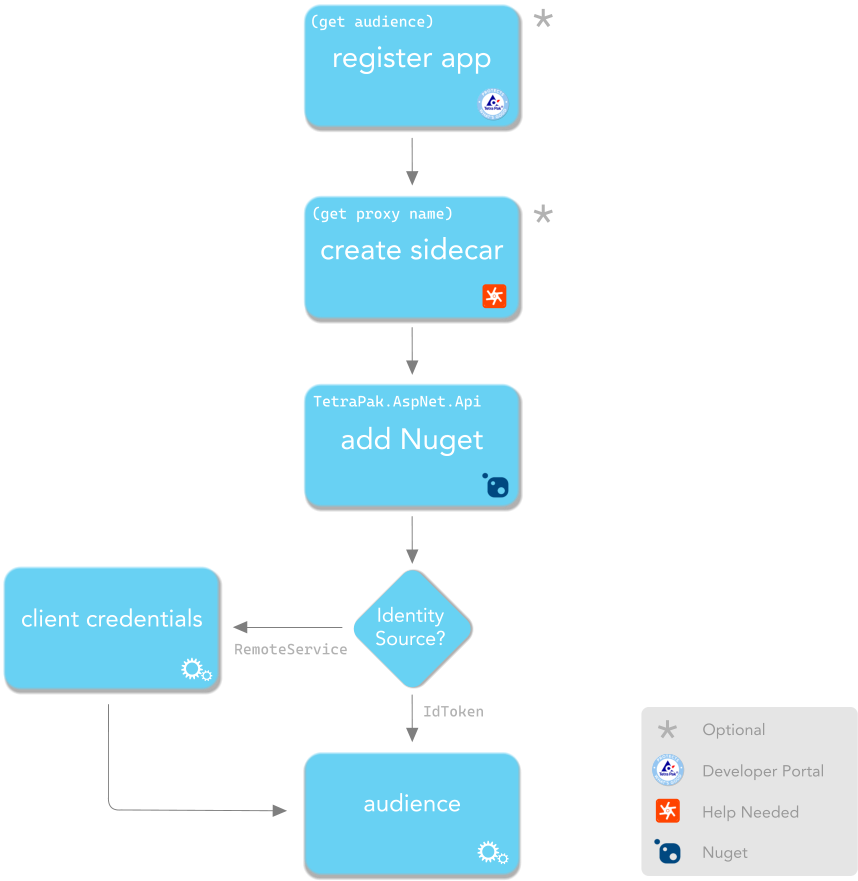

# Recipe: Create a Tetra Pak API

This document will walk you through integrating a small and simple ([terminus][cat-terminus]) API with the Tetra Pak Auth Services ([TPAS][cat-tpas]). After completion you should have a good understanding of how to integrate other [terminus APIs][cat-terminus] as well. 

> If you need an overview and some background then please check out the [README document][tetra-pak-aspnet-api-readme]. If you already know everything and just need the fast-track to integrating your existing API then there is also a neat [cheat sheet][tetra-pak-aspnet-api-cheat-sheet] (yes, that rhymes :-). 
>
> For many issues and typical use cases there is also a ["scenarios" document][tetra-pak-aspnet-scenarios] that might help you out. 
> 
> Finally, please consult the [terms and concepts][md-terms] document if you bump into unfamiliar vocabulary.

We will download a small micro service for the fictive "ACME corporation" to handle media assets, such as images. The micro service is a [terminus API][cat-terminus], meaning it is self-sufficient and will not consume other (remote) services. The micro service API is built with ASP.NET 5 and consist of a single controller with a single endpoint that supports all CRUD operations via the corresponding HTTP methods (Get, Post, Put, Patch and Delete). 

So, let's get started!

## Ingredients

To complete this recipe you will need:

- An internet connection, including access to the Tetra Pak's network and "Development" environment, directly or though a VPN

- A tool for writing, running and debugging code 
  
  You can use whichever tool you prefer, such as [Visual Studio][ide-vs], [VS Code][ide-vscode], [Rider][ide-rider], or any other tool. Those mentioned have good .NET support but the choice is yours.

- A tool to make test requests to your API.
  
  We till use [Postman][postman] for this but you are free to use any tool that works for you (see [disclaimer](#disclaimer)).

## Disclaimer

This recipe assumes you know how to write, run, and debug C# using your preferred IDE (Integrated Development Environment) be it [Visual Studio][ide-vs], [VS Code][ide-vscode], [Rider][ide-rider], [Eclipse][ide-eclipse] etc. We will not cover the exact how-to of each step required, such as creating a new project, add/restore Nuget packages, run a debug session, and so on. As these details differs from one IDE to the next you are expected to know the required steps.

## Overview 

Before we start the detailed walk-through, let's first get an overview of the steps required to create and integrate a Tetra Pak API:



In a real-life project there are, at the time of this writing*, a few steps where you need a favor from an [API manager][cat-api-manager]; someone with access to Tetra Pak's [API Management System][cat-apigee-edge], and that knows how to use it. In the flow chart (above) those steps are marked with asterisks (*). For this recipe you will need two pieces of information from this:

- The API [audience][cat-audience] identifier
- The [sidecar][cat-sidecar] name (optional)
  
> If you don't want to just sit around, waiting to get this information, we have configured a special "demo" [sidecar][cat-sidecar] for you. If you prefer using this pre-configured resource then the [audience][cat-audience] and [sidecar][cat-sidecar] identifier is the same: "`demo_api`". If this is how you want to build your demo API then you can skip the first two preparation steps and continue with [downloading the API project](#download-the-demo-projects).
>
> \* *The API innovation team strives to provide tools and services to make developers as autonomous and empowered as possible, but as of now some steps needs to be vetted and approved manually.*

1. [**Register the API with Tetra Pak**](#register-the-api-with-tetra-pak)
  
   Before we can integrate the API with [TPAS][cat-tpas] we need to first [register it as an "app"][cat-client] with Tetra Pak. In this step we'll browse over to the [Tetra Pak Developer Portal][tetra-pak-dev-test-portal] and see how that is done. We will need some information from this step, such as the [audience][cat-audience].

   > \* *An `app registration` is how [TPAS][cat-tpas] "knows" about your API and which clients consume it. Clients of APIs also needs to be recognized and, often, your API needs to consume other APIs, effectively making it both an API **and** a client of other services ([see API recipe 2][tetra-pak-aspnet-api-recipe-2]). We just use the term "app registration" or "app" for sake of simplicity.*
  
2. [**Create a *sidecar***](#create-a-sidecar)
  
   Your API will be managed and protected by its [sidecar][cat-sidecar] (deployed with Tetra Pak's [API management system][cat-apigee-edge]) so we need one set up for us by an [API manager][cat-api-manager].

3. [**Download the demo projects**](#download-the-demo-projects)
  
   This recipe is about integrating an API, not about building it. To keep it simple and focused we will download a demo project. 
  
4. [**Add SDK Nuget package**](#add-sdk-nuget-package)
  
   This step is where you add the SDK support and should be very straight forward. But, again, there will be no detailed steps as the exact flow differs between IDEs.

5. [**Write the integration code**](#write-the-integration-code)

   This section explains what code needs to be added into the `Startup` configuration methods to add the necessary services and [middleware][cat-middleware] needed by the Tetra Pak [TPAS][cat-tpas] integration.

6. [**Configure the integration**](#configure-the-integration)
  
   We add the necessary configuration to integrate with [TPAS][cat-tpas] and set your API up to be function behind its [sidecar][cat-sidecar]. We'll need some details ([audience][cat-audience] and [sidecar][cat-sidecar] name) from the previous steps to complete this one (or use the pre-configured "`demo_api`" [audience][cat-audience]/[sidecar][cat-sidecar].

   In the above flow diagram you will notice that for configuration there is a choice to be made: "Identity Source". We will explain this in more detail later but, just to give a hint, going with the "`IdToken`" source is faster but also quite limited, whereas the "`RemoteService`" might allow for richer actor information, at the price of a bit more complexity and a small performance hit.

7. [**Test the API**](#test-the-api)
  
   When we're done we need to test the API. For this we need a [registered "app"][cat-client], set up to be a trusted client of our new API. This is also done from the [Tetra Pak Developer Portal][cat-dev-portal].
  
   We will then make test requests to the new API using [Postman][postman].

So, with the plan firmly set in our mind, let's do this...

## Register the API with Tetra Pak

 >This step of the recipe will demonstrate how to [register an "app"][cat-client] with Tetra Pak. This is so you can do it yourself in your projects. After registering you would then need the assistance of an [API manager][cat-api-manager] to configure your registered app and create a [sidecar][cat-sidecar] for it. 
 >
 > For the sake of this recipe you can instead rely on a pre-configured app registration, to avoid the lead time from having to reach out and wait for your registration to be configured and ready for use. Read through the following steps if you want to understand how to register your API "app". Alternatively, just use the pre-configured "`demo_api`" resource for [audience][cat-audience] and [sidecar name][cat-sidecar] and move on to [downloading the API project](#download-the-demo-projects)    

 For any app to integrate with [TPAS][cat-tpas] it needs to be recognized by Tetra Pak. This is done by simply registering the app, with a name and unique "[consumer key][cat-client-id]". You do this in the [Tetra Pak developer portal][tetra-pak-dev-test-portal] like so:

1. Open a browser and navigate to the [Tetra Pak developer portal][tetra-pak-dev-test-portal]

   >This instruction assumes you are starting out with a DEV (Development) [runtime environment][cat-runtime-environment]. For PROD (Production) please use the [production development portal][tetra-pak-dev-portal].

2. Log in
   
3. Click the "Apps" menu item at the top of the page
   
4. Click the "Add app" command (upper left part of page)
   
5. Give your app a name and supply a short description of it
   
6. Specify the [Callback URL][cat-callback-url]. The default callback path for this SDK is `/auth-callback`. So, for example, if your local host is `https://localhost:8080` then the [Callback URL][cat-callback-url] should be `https://localhost:8080/auth-callback`. Using a "localhost" callback is, of course, for local testing only. In a real-life project this value can usually be left to its initial (default) value.

   > Please note that this value can be edited later if you return to your app registration and select the "Edit" tab (will be visible once you save your app registration). If you are unsure at this time which port you'll be using locally then just change this value later, when you know the full callback URL. [For more information please go here][tetra-pak-dev-portal-appreg-callback].

7. In a "real" web API you would probably want to consume one or more [API products][cat-product]. For this recipe that is not the case (we will cook a "[terminus API][cat-terminus]"). However, please double check that the "`Enterprise Application Security`" service is already selected, or select it otherwise. This service is critical for integrating with [TPAS][cat-tpas] (you might have to scroll down to see it).

8. Click "ADD APP" (bottom of the web page)
   
9. You are now presented with your app overview page, where all your [app registrations][cat-app-registration] are listed. Please select the one you just created by clicking it. This should present the App details, such as the [client credentials][cat-client-credentials] ([Consumer Key][cat-client-id] and [Consumer Secret][cat-client-secret]).
  

## Create a sidecar

All Tetra Pak APIs must be *managed*, meaning they must be running "behind" a [sidecar][cat-sidecar] (a managed reverse proxy). Getting a [sidecar][cat-sidecar] set up and configured is unfortunately (at the time of this writing) not something you can do yourself. Instead, your project should have one assigned [API manager][cat-api-manager] that you need to turn to to get this done. Usually, it's a fairly quick process but you need to reach out to get this done and then wait for these tasks to be completed. In doing so you need to get this information back:

1. You will have to agree on an [audience][cat-audience] for the [JWT Bearer Assertion flow][cat-jwt-bearer-assertion] to work. This is simply a name (or "*identifier*") to be used by your [sidecar][cat-sidecar]. Negotiate a suitable [audience][cat-audience] identifier for your [API manager][cat-api-manager].
   
2. If you plan to consume other services (APIs) from your API, you need to mention this requirement to your [API manager][cat-api-manager]. This will affect how your sidecar gets configured. For this recipe this is not needed (see the [next API recipe][tetra-pak-aspnet-api-recipe-2] for an example of an API that consumes other Tetra Pak services).
   
3. Ask the [API manager][cat-api-manager] to add the ability for a [*Development Proxy*][cat-dev-proxy]. This is so you can run and debug your API locally. If that was unclear; don't worry. We'll get back to this shortly. Just read on. 
   
4. When you get the [sidecar name][cat-sidecar] and [audience][cat-audience], note them down for later.

## Get the demo API details

> Like stated before; for this recipe you can skip this step and instead rely on a pre-configured resources. Just use the [audience][cat-audience] identifier "`demo_api`".

1. Browse to the [Tetra Pak developer portal][tetra-pak-dev-test-portal].
   
2. Click the "Apps" menu item at the top of the home page.

3. Copy the [Callback URL][cat-callback-url] (and then paste it somewhere for later reference): 
   
   

4. Ask your [API manager][cat-api-manager] for the negotiated [audience][cat-audience] identifier (and save it somewhere).

## Download the demo projects

To speed things up, focusing on the integration part rather than on implementing the actual micro service, go ahead and [download these projects][github-tetrapak-acme-demo-zip]:

- `demo.Acme.Common`
- `demo.Acme.Assets`

> *The demo projects are part of a .NET solution that also contains a third project: `demo.Acme.Products`. This project is the focus of the [second API recipe][tetra-pak-aspnet-api-recipe-2] and will not be covered here.*
> 
> ***NOTE!** If you are downloading and unpacking the demo projects on a Mac you are likely to bump into the Mac's "Gatekeeper" that informs you it cannot be opened as the file was downloaded from an "unknown developer". If that happens you might have to Ctrl+RClick to open it. There might also be an "Open anyway" option available for an hour in the Mac's Settings >> Security & Privacy.*

The `demo.Acme.Common` project supports the data model and introduces useful abstractions, such as an interface for repositories (`/abstractions/IRepository.cs`) and a basic implementation for it (`/Repositories/Repository.cs`). There's also some helper classes to  help us get a collection of assets to work with (`/Seeding/AssetsSeeder.cs`). Finally, the `demo.Acme.Common` project gives us a base data model (`/Models/Model.cs`) that is derived from by the specialized `Asset` model (`/Models/Asset.cs`). With this brief orientation you should be able to just read the code and figure it out if you feel it is of interest.

The `demo.Acme.Assets` project is our micro service, to be integrated with [TPAS][cat-tpas] and it is dependent on the `demo.Acme.Common` project. The API consists of a single controller - `AssetsController` - and a single endpoint that supports all CRUD operations, implemented by the controller's `Get`, `Post`, `Put`, `Patch`, and `Delete` action methods. The API project also contains a `/Data` folder with classes to implement persisting (uploaded) assets in the file system, as well as an `AssetsRepository` class to abstract the "assets" data layer.

## Add SDK Nuget package

Before you start adding the code and configuration needed to integrate the micro service API with [TPAS][cat-tpas] you first need to add the SDK's Nuget package [TetraPak.AspNet.Api][nuget-tetrapak-api] as there will be one or two extension methods in our code that requires it. 

As the `demo.Acme.Assets` project is relying on the `demo.Acme.Common` project it is enough to just add this Nuget to the latter. Go ahead and add the [TetraPak.AspNet.Api][nuget-tetrapak-api] Nuget to the `demo.Acme.Common` project now.

## Write the integration code

To successfully integrate your API you need to:

1. In the `demo.Acme.Assets` project; open the `Startup.cs` file and look for the "TODO" comment in the `ConfigureServices` method. Replace the comment with this code:

   ```c#
   services.AddTetraPakJwtBearerAssertion();
   ```

   This code adds the required services for Tetra Pak's [JWT bearer assertion][cat-jwt-bearer-assertion] mechanism. Having added this line, it becomes necessary to run your API "behind" a managed [sidecar][cat-sidecar]. This would make it impossible to run and  debug your API locally, using the tools of your IDE. We will deal with that problem later in this recipe though.

2. Navigate to the `Configure` method of the `Startup` class and look for the "TODO" comment. Replace the comment with this line:


   ```c#
   app.UseTetraPakApiAuthentication(env);
   ```

   With that, the coding part of the integration is complete. The `UseTetraPakApiAuthentication` method sets everything up to protect your secure endpoints (action methods or controllers protected with the `[Authorize]` attribute). 


## Configure the integration

Everything related to Tetra Pak integration must be added to a custom configuration section named "TetraPak". The SDK also supports a code API for this integration configuration via the class `TetraPakConfig`. That class is the root of a graph that reflects the configuration for several different services offered by the SDK but we will keep with just what's needed for this recipe. Other recipes introduces and explains more integration services.

1. Open the `appsettings.json` file in an editor and add section `"TetraPak"` and a sub section to configure your [JWT Bearer Assertion][cat-jwt-bearer-assertion] (ensuring only the sidecar can make requests to your protected endpoints). As a minimum the sub section needs to include the expected [audience][cat-audience]:

    ```json
    {
       "TetraPak": {
          "JwtBearerAssertion": {
             "Audience": "(audience)"
          }
       }
    }
    ```

  > For [audience][cat-audience] you can use the pre-configured value "`demo_api`". However, if you registered your own app earlier (and requested a [sidecar][cat-sidecar] for it) you need to get the corresponding `audience` value from your [API manager][cat-api-manager].

With this you have now integrated your API with [Tetra Pak Auth Services][cat-tpas] and your are ready to test it. 

But there is a problem ...


## The development proxy

Are you the type of developer that can code up a complex API and deploy it to its host and everything just works? Then congratulations, you are a very rare (and probably extremely well paid) individual. That, however, is not how most of us do it. 

In the real world we will face issues and we'll want ways to understand what happens when *happy flows* breaks and stuff acts up. For this you will want to rely on all the productive debugging and analysis tools supported by your IDE! 

Once your code runs on the remote host you are basically left with *poor man's debugging*, relying on whatever data you remembered to dump to the logs or other diagnostics services. Sure, some IDEs, such as [Visual Studio][ide-vs], offer the ability to attach the debugger to the remote process but anyone that has ever tried it can testify this makes for a pretty miserable experience. Remote debugging is usually very *laggy* which makes it difficult to mentally follow the flow as you step through your code.

Instead, you will want to be able to debug your API code locally, *"on your desktop"*. This is where you are most productive and can quickly step through the code to understand what happens. So, *ideally*, you would now want to be able to just run your API on [`https://localhost:5001`](https://localhost:5001) (again, port *may* vary) and do what you're used to when debugging your code. 

The problem is we have just configured the API to ***only work when it is protected by its [sidecar][cat-sidecar]***. That [sidecar][cat-sidecar] is run by the [API management system][cat-api-management-system] on a remote host somewhere and cannot, under any circumstance, monitor and direct traffic to or from your desktop! 

What we could do, of course, is to add some "extra" `if`s and `else`s to remove the [sidecar][cat-sidecar] requirement from your API when the code detects it is being deployed to your local desktop. 

You *could*, for example, add compiler flags to only configure the `Startup` class for the [Sidecar JWT Bearer Assertion][cat-jwt-bearer-assertion] scheme and then more compiler flags to get rid of the `[Authorize]` attribute from all protected controller endpoint methods.

You *could* maybe do it in some other way but this would be a very bad idea. Not only would it mean stripping away the [TPAS][cat-tpas] integration, which we rely on to get the [actor's][cat-actor] identity. It is also a risky business to introduce compiler flags in your code just to allow local debugging. Overall, this approach would mean you'd test and debug code locally which would be very different from the code you plan to deploy. That is a very rickety concept, at best. Also, you will introduce a *not-negligible* risk (&lt;-- understatement) of deploying the *wrong* code to the host, causing bugs and general misery for everyone, with loss of time, money, and trust from important stakeholder as a very probable consequence.

So, if we can't fake it to allow running and debugging the [API][cat-api] *on the desktop*, and we also can't rely on the necessary [sidecar][cat-sidecar], then what? Are we stuck?!


*Fear not young Padawan! The Tetra Pak SDK is here to help with some neat Jedi magic!*

The SDK supports a local (desktop) "development proxy" tool that you can simply activate by adding the `"DevProxy"` key and the name of the actual sidecar (from [step 4 in the "Create a sidecar"](#create-a-sidecar) section earlier). Now, add the `"DevProxy"` to the `"JwtBearerAssertion"` sub section:

```json
{
  "TetraPak": {
    "JwtBearerAssertion": {
      "Audience": "(audience)",
      "DevProxy": "(sidecar name)"
    }
  }
}
```

Just stating actual [sidecar's][cat-sidecar] name is the preferred and most resilient method of enabling the `DevProxy` but you can also specify the full URL if needed. Either way, you will need to consult your [API manager][cat-api-manager] to get the name of your [sidecar][cat-sidecar]. 

Again, if you prefer using the pre-configured [sidecar][cat-sidecar] it is called: "`demo_api`". If so, use this configuration:

```json
{
  "TetraPak": {
    "JwtBearerAssertion": {
      "Audience": "demo_api",
      "DevProxy": "demo_api"
    }
  }
}
```

If you opted to create your own [app registration][cat-client], however, then you'll need to get the name of the proxy from your [API manager][cat-api-manager].

> **IMPORTANT!**
>
> To avoid deployment mistakes the (desktop) `DevProxy` will ***only*** work when you are running your API *locally*, meaning when all the bound host addresses contain the pattern "`://localhost`".

## Register a client with Tetra Pak

We are almost done! What remains now is to test your API. For that we will use [Postman][postman] - a popular tool for API testing and development. But before we can test the API we need a registered client for it.

1. Open a browser and navigate to the [Tetra Pak developer portal][tetra-pak-dev-test-portal]
    
    > This instruction assumes you are starting out with a [DEV (Development) environment][cat-runtime-environment]. For the PROD (Production) [environment][cat-runtime-environment] please use the [Production development portal][tetra-pak-dev-portal].

2. Log in
   
3. Click the "Apps" menu item at the top of the page 
   
4. Click the "Add app" command (upper left part of page) 
   
5. Give your client app a name and supply a short description of it (such as "Test client for Anna's API recipe")
   
6. Unlike with the API you can leave the [Callback URL][cat-callback-url] as-is. You will need it later, when you are testing the API with [Postman][postman], so please note it down (or get back to the client app later when you need this value) 
   
7. Copy the "`Consumer Key`" (a.k.a. [client id][cat-client-id]), to be used in the next, final, section.

## Test the API
 
With a [sidecar][cat-sidecar] available and a local [DevProxy][cat-dev-proxy] enabled you should now be able to test the protected `/media/assets` endpoint. To test this you need a tool that allows for authenticating with Tetra Pak and then make the request using the security token of that authorization. We'll use [Postman](https://www.postman.com) for this.

1. Install and start [Postman](https://www.postman.com/downloads/).
   
2. From the menus select "File >> New ... >> HTTP Request".
   
3. In the new request UI ensure the method is set to "GET" (should be the default) and add the request URL (eg. `https://localhost:5006/media/assets`).
   
### Setting up authorization

We now need to set up the authorization configuration so that you can obtain an access token to be sent to your new [API][cat-api]. Well, actually, the request (and token) are of course sent to your new API's [sidecar][cat-sidecar] who will exchange this token for a short-lived JWT bearer token to be sent along with the request to your API, as per the [Sidecar JWT Bearer Assertion][cat-jwt-bearer-assertion] authorization [scheme][cat-authentication-scheme].

Here's how you configure [Postman](https://www.postman.com/downloads/) to authenticate:

4. Set the "[Callback URL][cat-callback-url]" to the value you copied from step 6 in the [previous section](#register-a-client-with-tetra-pak)
   
5. Set "Auth URL" to: "https://api-dev.tetrapak.com/oauth2/authorize"
   
6. Set "Access Token URL" to: https://api-dev.tetrapak.com/oauth2/token
 
7. Set the "[Client ID][cat-client-id]" to the ("Consumer Key") value you copied from step 7 in the [previous section](#register-a-client-with-tetra-pak)

   > [Postman][postman] might warn about adding the [Client ID][cat-client-id] as a string literal like this, suggesting that your should create a [Postman][postman] variable and reference it instead. If you're not sure what that is all about then just ignore it. For real-life work you should follow Postman's advice, though, and always avoid blurting potentially sensitive strings into UIs or plain text files.
   
8. From the "Client Authentication" drop down list, select "Send client credentials in body"

This should cover everything needed to successfully obtain a security token. Let's try it out:

9. Scroll down to the "Get New Access Token" button and click it!

10. You should now see a dialog open and, after a second or so, another dialog indicating the authentication is completed successfully. Either click "Proceed" or wait a few more seconds. 
    
11. That dialog should now be replaced with a bigger one containing the details for the token you where just granted. Click "Use Token".'
    
12. Finally, the real test: Click "Send"


That's it! Try running your API locally. If you run into trouble, please consult the [scenarios document][tetra-pak-aspnet-scenarios].

[tetra-pak-aspnet-api-readme]: ../README.md
[tetra-pak-aspnet-api-readme-jwt-writing-apis]: ../README.md#writing-apis
[tetra-pak-aspnet-api-cheat-sheet]: ./cheatsheet-webapi.md
[tetra-pak-aspnet-api-recipe-2]: ./Recipe2-WebApi.md
[tetra-pak-aspnet-scenarios]: ../../_docs/Scenarios.md
[tetra-pak-aspnet-scenarios-no-browser]: ../../_docs/Scenarios.md#issue-no-browser-window-opens-when-i-run-my-web-app
[tetra-pak-aspnet-scenarios-invalid-redirect-uri]: ../../_docs/Scenarios.md#error-400---invalid-redirect_uri
[github-tetrapak-acme-demo]: https://github.com/Tetra-Pak-APIs/TetraPak.AspNet.Acme.Demo
[github-tetrapak-acme-demo-zip]: https://github.com/Tetra-Pak-APIs/TetraPak.AspNet.Acme.Demo/archive/refs/heads/master.zip
[github-tetrapak-app]: https://github.com/Tetra-Pak-APIs/TetraPak.AspNet/tree/master/TetraPak.AspNet
[nuget-tetrapak-app]: https://www.nuget.org/packages/TetraPak.AspNet
[github-tetrapak-api]: https://github.com/Tetra-Pak-APIs/TetraPak.AspNet/tree/master/TetraPak.AspNet.Api
[nuget-tetrapak-api]: https://www.nuget.org/packages/TetraPak.AspNet.Api
[github-tetrapak-common]: https://github.com/Tetra-Pak-APIs/TetraPak.Common
[nuget-tetrapak-common]: https://www.nuget.org/packages/TetraPak.Common
[demo.web-app]: https://github.com/Tetra-Pak-APIs/TetraPak.AspNet/tree/master/demo.WebApp
[di-intro-1]: https://medium.com/flawless-app-stories/dependency-injection-for-dummies-168dad181a3d
[di-intro-2]: https://www.freecodecamp.org/news/a-quick-intro-to-dependency-injection-what-it-is-and-when-to-use-it-7578c84fa88f/
[middleware]: https://docs.microsoft.com/en-us/aspnet/core/fundamentals/middleware/?view=aspnetcore-5.0
[oauth-refresh-flow]: https://datatracker.ietf.org/doc/html/rfc6749#section-1.5
[repository-pattern]: https://martinfowler.com/eaaCatalog/repository.html
[aspnet-core-configuration]: https://docs.microsoft.com/en-us/aspnet/core/fundamentals/configuration/?view=aspnetcore-5.0
[tetra-pak-dev-test-portal]: https://developer-test.tetrapak.com
[tetra-pak-dev-dev-portal]: https://developer-dev.tetrapak.com
[tetra-pak-dev-portal]: https://developer.tetrapak.com
[tetra-pak-dev-portal-appreg-consumer-key]: https://developer.tetrapak.com/products/getting-started/manage-your-app#consumer-key
[tetra-pak-dev-portal-appreg-callback]: https://developer.tetrapak.com/products/getting-started/manage-your-app#callback-url
[tetra-pak-dev-portal-api-guidelines]: https://developer.tetrapak.com/products/api-design
[hsts]: https://en.wikipedia.org/wiki/HTTP_Strict_Transport_Security
[aspnet-layout]: https://docs.microsoft.com/en-us/aspnet/core/mvc/views/layout?view=aspnetcore-5.0
[aspnet-authorize-attribute]: https://docs.microsoft.com/en-us/aspnet/core/security/authorization/simple?view=aspnetcore-5.0
[aspnet-razor]: https://docs.microsoft.com/en-us/aspnet/web-pages/overview/getting-started/introducing-razor-syntax-c
[ide-vs]: https://visualstudio.microsoft.com/
[ide-vscode]: https://code.visualstudio.com/
[ide-rider]: https://www.jetbrains.com/rider/
[ide-eclipse]: https://www.eclipse.org/ide/
[postman]: https://www.postman.com/

[md-RespondAsync]: ./_code/TetraPak_AspNet_Api_Controllers_ControllerBaseExtensions.md#controllerbaseextensionsrespondasynclttgtcontrollerbase-outcomelttgt-int-readchunk-responsedelegatelttgt-method
[md-ControllerBaseExtensions]: ./_code/TetraPak_AspNet_Api_Controllers_ControllerBaseExtensions.md
[md-Outcome-T]: https://github.com/Tetra-Pak-APIs/TetraPak.Common/blob/master/TetraPak.Common/_docs/_code/TetraPak_Outcome_T_.md
[md-EnumOutcome-T]: https://github.com/Tetra-Pak-APIs/TetraPak.Common/blob/master/TetraPak.Common/_docs/_code/TetraPak_EnumOutcome_T_.md
[md-prop-TetraPakConfig-IdentitySource]: ../../TetraPak.AspNet/_docs/_code/TetraPak_AspNet_TetraPakConfig.md#tetrapakconfigidentitysource-property
[md-type-TetraPakIdentitySource]: ../../TetraPak.AspNet/_docs/_code/TetraPak_AspNet_Auth_TetraPakIdentitySource.md

[md-setting-localhost-port]: ../../_docs/Scenarios.md#setting-the-localhost-port
[md-terms]: ../../_docs/CAT.md
[cat-actor]: ../../_docs/CAT.md#actor
[cat-api]: ../../_docs/CAT.md#api
[cat-api-key]: ../../_docs/CAT.md#api-key
[cat-api-management-system]: ../../_docs/CAT.md#api-management-system
[cat-api-manager]: ../../_docs/CAT.md#api-manager
[cat-app-registration]: ../../_docs/CAT.md#app-registration
[cat-audience]: ../../_docs/CAT.md#audience
[cat-authentication]: ../../_docs/CAT.md#authentication
[cat-authentication-scheme]: ../../_docs/CAT.md#authentication-scheme
[cat-apigee-edge]: ../../_docs/CAT.md#apigee-edge
[cat-business-api]: ../../_docs/CAT.md#business-api
[cat-callback-url]: ../../_docs/CAT.md#callback-url
[cat-claim]: ../../_docs/CAT.md#claim
[cat-claims-transformation]: ../../_docs/CAT.md#claims-transformation
[cat-client]: ../../_docs/CAT.md#client
[cat-client-credentials]: ../../_docs/CAT.md#client-credentials
[cat-client-id]: ../../_docs/CAT.md#client-id
[cat-client-secret]: ../../_docs/CAT.md#client-secret
[cat-consumer-key]: ../../_docs/CAT.md#consumer-key
[cat-dev-portal]: ../../_docs/CAT.md#developer-portal
[cat-dev-proxy]: ../../_docs/CAT.md#development-proxy
[cat-identity]: ../../_docs/CAT.md#identity
[cat-jwt-bearer-assertion]: ../../_docs/CAT.md#jwt-bearer-assertion
[cat-middleware]: ../../_docs/CAT.md#middleware-aspnet
[cat-product]: ../../_docs/CAT.md#product
[cat-runtime-environment]: ../../_docs/CAT.md#runtime-environment
[cat-sidecar]: ../../_docs/CAT.md#sidecar
[cat-terminus]: ../../_docs/CAT.md#terminus-api
[cat-tpas]: ../../_docs/CAT.md#tetra-pak-auth-services