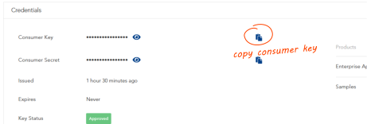

# Recipe: Create a Tetra Pak API

This document will walk you through creating a small ASP.NET Core/5+ API and integrate it with the Tetra Pak Auth Services. After completion you should have a good understanding of how to integrate an existing API as well. 

The API will consist of a single "hello" controller with two endpoints: One default `/hello` endpoint that will return a message saying "Hello", followed by the name of the user, and a `hello/version` endpoint that will return the API version (taken from the running assembly metadata). 

To resolve the identity of the caller the first endpoint (`/hello`) requires actor authentication, which is why the API needs to be integrated with the Tetra Pak Auth Services! The second (`hello/version`) endpoint will not, however, require actor authentication as it should be publicly available.

>If you need an overview and some background then please check out the [README document][tetra-pak-aspnet-api-readme]. If you already know everything and just need the fast-track to integrating your existing API then there is also a neat [cheat sheet][tetra-pak-aspnet-api-cheat-sheet] (yes, that rhymes :-). Finally, for many issues there is a small ["scenarios" document][tetra-pak-aspnet-scenarios] that might help you out.

### Disclaimer

This recipe assumes you know how to write C# code with your preferred IDE (Integrated Development Environment) be it [Visual Studio][ide-vs], [VS Code][ide-vscode], [Rider][ide-rider], [Eclipse][ide-eclipse] etc. We will not cover the exact how-to of each step required, such as creating a new project, add/restore Nuget packages and so on. As these details differs from one IDE to the next you are expected to know how to do that.

### Creating a web API (ASP.NET Core / ASP.NET 5+)

For sake of convenience the project will be called "TetraPakHelloApiRecipe".

Create a ASP.NET Web API project, name it "`TetraPakHelloApiRecipe`". Please pick a suitable project template. 

> If your IDE project templates present you with the option to add "Auth" or "Authentication" in some way, please opt out. We will add authentication manually later in this recipe as it's pretty simple anyway.
> Also, the project template wizard (if your IDE supports one) might offer a "type" of web appliction, such as MVC Razor or API and so on. If possible select the API option.

The recipe assumes the default controller is called `HelloController`. If the project scaffolded some default controller for you; just rename it and remove all the code, or delete the class file and create an empty `HelloController` instead class under the "Controllers" folder (create the folder if it wasn't created for you).

This is what the folder/file structure should look like as a minimum (your IDE's project template might have added more files and folders - that's ok). If these files and folders wasn't created by your IDE then please create them:

```
+-- TetraPakApi
    |
    +-- Controllers
    |   |
    |   +-- HelloController.cs
    |
    +-- appsettings.js
    +-- Program.cs
    +-- Startup.cs
```

Before we start coding you first need to add the SDK's Nuget package [TetraPak.AspNet.Api][nuget-tetrapak-api] as there will be one or two extension methods in our code that requires it. The way you add Nuget packages to you project differs from one IDE to another so we won't cover that in detail. Add the [TetraPak.AspNet.Api][nuget-tetrapak-api] now.

Lets look at the contents of each file, starting with the `HelloController` class and work our way down:

```c#
// ./Controllers/HelloController.cs

using System.Runtime.CompilerServices;
using System.Threading.Tasks;
using Microsoft.AspNetCore.Authorization;
using Microsoft.AspNetCore.Mvc;
using Microsoft.Extensions.Logging;
using TetraPak;
using TetraPak.AspNet.Api.Controllers;
using TetraPak.Logging;

namespace TetraPakHelloApiRecipe.Controllers
{
    [ApiController]
    [Route("[controller]")]
    [Authorize]
    public class HelloController : ControllerBase
    {
        readonly ILogger<HelloController> _logger;

        [HttpGet]
        public Task<ActionResult> Get()
        {
            logRequest();
            var hello = new { Message = "Hello World!" };
            return this.RespondAsync(Outcome<object>.Success(hello));
        }

        [AllowAnonymous]
        [HttpGet, Route("version")]
        public Task<ActionResult> GetVersion()
        {
            logRequest();
            var data = new { Version = typeof(Startup).Assembly.GetName().Version?.ToString() ?? "(unknown)" };
            return this.RespondAsync(Outcome<object>.Success(data));
        }

        void logRequest([CallerMemberName] string endpoint = null)
        {
            _logger.Trace($"{User.FirstName()} {User.LastName()} called {endpoint}");
        }

        public HelloController(ILogger<HelloController> logger)
        {
            _logger = logger;
        }
    }
}
```

The controller is decorated with the `[Authorize]` attribute, meaning all endpoints will require an authenticated user to authorize the request.

To allow logging the controller constructor (ctor) accepts a logger provider (`ILogger<HelloController>`) which is stored in a private `readonly` field: `_logger`. Please note that this logger provider is automatically injected by ASP.NET's dependency injection mechanism as the controller gets instantiated. The controller declares a convenient private method - `logRequest()` - that will simply trace the actors identity (first and last name) along with the endpoint method name.

> This is just to show some convenient extension methods for logging and getting the actor's identity (first and last name). If you actually want a good trace of all requests, including the request URL, headers and, possibly, body, there are better methods to do so but that's beyond the scope of this recipe.

The default endpoint is just decorated with the `[HttpGet]` attribute, making it the default endpoint for this controller: `/hello`. Let's look at its content:

```c#
[HttpGet]
public Task<ActionResult> Get()
{
    logRequest();
    var hello = new { Message = "Hello World!" };
    return this.RespondAsync(Outcome<object>.Success(hello));
}
```

The `logRequest()` has already been explained so lets instead examine how the response is being constructed: We're instantiating an anonymous object, to the `hello` variable, that contains a single value - "Hello World!" - in its `Message` property. If we where to just return this value as-is the response would simply be its JSON serialized form: 

```json
{
  "message": "Hello World!"
}
```

That might be fine but we're striving a bit higher than that. We want this API not to be just "any API". We're instead aiming to make this a ***Tetra Pak business API***! 

### Tetra Pak business API 

What that means is it should be a reusable "general purpose" API. To make an API "reusable" means your clients should find it worthwhile to invest in reusable code components to make request and handle the responses, successful ones as well as failed ones. For that to happen you need to make sure your clients doesn't have to write complex messy code with endless if-else clauses everywhere, do deal with exceptions and inconsistencies. This means everything from naming conventions to format. If a certain type of resource is called "Message", for instance, in one endpoint then you should take care to call it the same thing everywhere else it's being referenced or consumed. 

Failing to design an API that is consistent in conventions and format will mean it is going to ne costly write code for. Not only will it (likely) mean writing a lot of code to deal with all the inconsistencies. It will also make little sense investing in writing code components to be reused when consuming a different API, as those other APIs will be different anyway. 

On the other hand, if you follow Tetra Pak's guidelines you have a very high chance of creating a successful API as your clients might already have invested in such code components in previous projects that also consume Tetra Pak business APIs. As they are now about to consume your API, and you stick to the same design principles, conventions and formats, that client can likely focus on adding code just to deal with the differences, which should be few indeed.

You can read more about [Tetra Pak's API guidelines here][tetra-pak-dev-portal-api-guidelines], but to summarize, this is how your response should be formatted:

```json
{
  "meta": {
    "total": (total-number-of-items-available)
  },
  "data": [
    (data-as-a-list)
  ]
}
```
 
This format is the bare minimum of what to expect from a Tetra Pak API. Please note that the requested data is *always* returned as a list, even if there is just one item. This approach allows for much better code reuse and makes investing in code components for consuming standardized Tetra Pak APIs a very good idea. 

The good news is; by using this SDK you can automatically adhere to the recommended Tetra Pak response format! Simply send your data back using the `RespondAsync` extension method for `ControllerBase` and your good to go.

With this your API should build and run. Run the API from your IDE and note the address it binds to, such as this example: `https://localhost:5001`. (Please note the port might be different in your case. If so; note it and use that instead as we move forward). 

Now browse to that address and the "version" endpoint: `https://localhost:5001/hello/version`, using a browser or some preferred tool for testing your APIs, such as [Postman](https://www.postman.com/) or [Curl](https://curl.se/). If all goes well then you should get this response:

```json
{
  "meta": {
    "total": 1
  },
  "data": [
    {
      "version": "1.0.0.0"
    }
  ]
}
```

But what about the other, default, endpoint? You can try it out by just calling the `/hello` endpoint, like in this example: `https://localhost:5001/hello`.

This will fail miserably and you might even see  very technical response, including a stack trace and some error message that complains about there is no authentication scheme set up. That's as expected, as the `HelloController` only accepts authorized requests (we decorated it with the `[Authorize]` attribute) with `/hello/version` being the exception (we decorated that method with the `[AllowAnonymous]` attribute).

### Integrating with Tetra Pak Auth Services

We now need to integrate the API with Tetra Pak Auth Services, which is quite simple. Doing this will set up the needed authentication scheme - in this case the [Sidecar JWT Bearer Assertion][tetra-pak-aspnet-api-readme-jwt-bearer-assertion] scheme. We won't go into detail how that pattern actually works (follow the link for those details) but, long story short, it ensures all requests are made through your API's "sidecar" (proxy). Yup, that's right, your API must be protected by a reverse proxy that acts as its "sidecar". The proxy will help protect from malicious use, overuse (a.k.a. "throttling") and other typical issues you will face when hosting a new API.

So, to summarize, this is what is left on our TODO:

1. Register your API as an "app" (app registration) with Tetra Pak Auth Services. This is done in the Tetra Pak Developer Portal.
2. Ask to have a sidecar set up for your API. 
3. Configure your API to integrate with Tetra Pak. This will enable the necessary auth scheme.

### Register your App in Developer portal

For any app to integrate with the Tetra Pak Auth Services it needs to be recognized by Tetra Pak. This is done by simply registering the app, with a name and unique "consumer key" (a.k.a. "client id" or "API key"). You do this in the Tetra Pak Developer Portal like so:

1. Open a browser and navigate to the [Tetra Pak developer portal][tetra-pak-dev-test-portal]


>*This instruction assumes you are starting out with a DEV (Development) environment. For PROD (Production) please use the [Production development portal][tetra-pak-dev-portal].*


2. Log in
3. Click the "Apps" menu item at the top of the page
4. Click the "Add app" command (upper left part of page)
5. Give your app a name and supply a short description of it
6. Specify the Callback URL (from [this step](#save-local-url)). The default callback path for this SDK is `/auth-callback`. So, for example, if your local host is `https://localhost:8080` then the Callback URL should be `https://localhost:8080/auth-callback`

   > *Please note that this value can be edited later if you return to your app registration and select the "Edit" tab (will be visible once you save your app registration). If you are unsure at this time which port you'll be using locally then just change this value later, when you know the full callback URL. [For more information please go here][tetra-pak-dev-portal-appreg-callback].*

7. In a "real" web app you would probably want to consume one or more API products. For this recipe that is not the case. However, please double check that the "`Enterprise Application Security`" service is already selected, or select it otherwise. This service is critical for integrating with the Tetra Pak Auth Services. You might have to scroll down to see it

8. Scroll down to the end of the page and click "ADD APP"
9. You are now taken to your app overview page, where all your app registrations are listed. Please select the one you just created by clicking it. This should present the App details
10.  From the App details click the "copy" icon next to the "Consumer Key" (you will need this value in the next phase; [Integrating your Web App](#integrating-your-app-to-authenticate-with-tetra-pak)) so please paste it somewhere, or repeat this step to copy it when needed



### Ask for a sidecar

All Tetra Pak APIs must be managed and, therefore, must be running "behind" a sidecar (managed reverse proxy). Getting one set up is unfortunately (at the time of this writing) not something you can do yourself. Instead, your project should have one assigned "Apigee resource" that you need to turn to to get this done. Usually, it's a fairly quick process but you need to interact and get this information back:

1. If you plan to consume other services (APIs) from your API, you need to mention this requirement. This will affect how your sidecar gets configured. This is not needed for this recipe (see the [next API recipe][tetra-pak-aspnet-api-recipe-2] for that)
2.Ask the "Apigee person" to add the ability for a "Developer Proxy". We'll get back to this shortly. Just read on. 
3. You will have to agree on an "audience" for the [JWT Bearer Assertion][tetra-pak-aspnet-api-jwt-bearer-assertion] flow to work. Negotiate a suitable audience identifier for your proxy.
4. When you get the `sidecar name` and `audience`, note them down for later.

### Integrating your app to authenticate with Tetra Pak

We can now move on to the final stage: Integrating the API with Tetra Pak Auth Services to automatically authorize access to protected endpoints. This involves two steps:

- Add two lines of configuration
- Add two lines of code to enable Tetra Pak Sidecar [JWT Bearer Assertion][tetra-pak-aspnet-api-jwt-bearer-assertion] and Tetra Pak authentication

Let's begin with the configuration:

- Open the `appsettings.json` file in an editor and add section `"TetraPak"` with the consumer key as `"ClientId"`:

    ```json
    {
       "TetraPak": {
          "ClientId": "(consumer key)"
       }
    }
    ```

- Add a sub section to configure your [JWT Bearer Assertion][tetra-pak-aspnet-api-jwt-bearer-assertion] (ensuring only the sidecar can make requests to your protected endpoints). The sub section needs to include the expected audience:

    ```json
    {
       "TetraPak": {
          "ClientId": "(consumer key)",
          "JwtBearerAssertion": {
             "Audience": "(audience)"
          }
       }
    }
    ```

This is actually all you need to configure to successfully integrate the API with Tetra Pak Auth Services. if you are ready to deploy the API to its hosting service (on Azure or some similar environment), this would be enough. 

However, as a developer you will want to continue running your API locally (on `https://localhost:5001` in this example) to debug and develop your code further. But, again, the API *needs* its sidecar, which cannot sit on your desktop, of course. Fear not young padawan! The SDK's got you covered!

The SDK supports a local "desktop developer proxy" that you can simply activate by adding the "DevProxy" key and the name of the actual sidecar (from [step 4 in the "Ask for a sidecar"](#ask-for-a-sidecar) section earlier). Now, add the "DevProxy" to the "JwtBearerAssertion" sub section:

```json
{
  "TetraPak": {
    "ClientId": "(consumer key)",
    "JwtBearerAssertion": {
      "Audience": "(audience)",
      "DevProxy": "(sidecar name)"
    }
  }
}
```

> Just stating the `DevProxy` name is the preferred- and most resilient method of enabling the `DevProxy` but you can also specify the full URL if needed.

### Test the API
 
With a sidecar set up and a local dev proxy enabled you should now be able to test the protected `/hello` endpoint. To test this you need a tool that allows for authenticating with Tetra Pak and then make the request using the security token of that authorization. We'll use [Postman](https://www.postman.com) for this.

1. Install and start [Postman](https://www.postman.com/downloads/).
2. From the menus select "File >> New ... >> HTTP Request".
3. In the new request UI ensure the method is set to "GET" (should be the default) and add the request URL (eg. `https://localhost:5001/hello`).
4. 


That's it! Try running your API locally. If you run into trouble, please look into the [Troubleshooting document][tetra-pak-aspnet-issues].


[tetra-pak-aspnet-api-readme]: ../README.md
[tetra-pak-aspnet-api-readme-jwt-bearer-assertion]: ../README.md#the-sidecar-jwt-bearer-assertion-pattern
[tetra-pak-aspnet-api-cheat-sheet]: ./cheatsheet-webapi.md
[tetra-pak-aspnet-api-recipe-2]: ./Recipe2-WebApi.md
[tetra-pak-aspnet-api-jwt-bearer-assertion]: ../README.md#the-sidecar-jwt-bearer-assertion-pattern
[tetra-pak-aspnet-scenarios]: ../../Scenarios.md
[tetra-pak-aspnet-scenarios-no-browser]: ../../Scenarios.md#issue-no-browser-window-opens-when-i-run-my-web-app
[tetra-pak-aspnet-scenarios-invalid-redirect-uri]: ../../Scenarios.md#error-400---invalid-redirect_uri
[github-tetrapak-app]: https://github.com/Tetra-Pak-APIs/TetraPak.AspNet/tree/master/TetraPak.AspNet
[nuget-tetrapak-app]: https://www.nuget.org/packages/TetraPak.AspNet
[github-tetrapak-api]: https://github.com/Tetra-Pak-APIs/TetraPak.AspNet/tree/master/TetraPak.AspNet.Api
[nuget-tetrapak-api]: https://www.nuget.org/packages/TetraPak.AspNet.Api
[github-tetrapak-common]: https://github.com/Tetra-Pak-APIs/TetraPak.Common
[nuget-tetrapak-common]: https://www.nuget.org/packages/TetraPak.Common
[demo.web-app]: https://github.com/Tetra-Pak-APIs/TetraPak.AspNet/tree/master/demo.WebApp
[di-intro-1]: https://medium.com/flawless-app-stories/dependency-injection-for-dummies-168dad181a3d
[di-intro-2]: https://www.freecodecamp.org/news/a-quick-intro-to-dependency-injection-what-it-is-and-when-to-use-it-7578c84fa88f/
[middleware]: https://docs.microsoft.com/en-us/aspnet/core/fundamentals/middleware/?view=aspnetcore-5.0
[oauth-refresh-flow]: https://datatracker.ietf.org/doc/html/rfc6749#section-1.5
[aspnet-core-configuration]: https://docs.microsoft.com/en-us/aspnet/core/fundamentals/configuration/?view=aspnetcore-5.0
[tetra-pak-dev-test-portal]: https://developer-test.tetrapak.com
[tetra-pak-dev-dev-portal]: https://developer-dev.tetrapak.com
[tetra-pak-dev-portal]: https://developer.tetrapak.com
[tetra-pak-dev-portal-appreg-consumer-key]: https://developer.tetrapak.com/products/getting-started/manage-your-app#consumer-key
[tetra-pak-dev-portal-appreg-callback]: https://developer.tetrapak.com/products/getting-started/manage-your-app#callback-url
[tetra-pak-dev-portal-api-guidelines]: https://developer.tetrapak.com/products/api-design
[hsts]: https://en.wikipedia.org/wiki/HTTP_Strict_Transport_Security
[aspnet-layout]: https://docs.microsoft.com/en-us/aspnet/core/mvc/views/layout?view=aspnetcore-5.0
[aspnet-authorize-attribute]: https://docs.microsoft.com/en-us/aspnet/core/security/authorization/simple?view=aspnetcore-5.0
[aspnet-razor]: https://docs.microsoft.com/en-us/aspnet/web-pages/overview/getting-started/introducing-razor-syntax-c
[ide-vs]: https://visualstudio.microsoft.com/
[ide-vscode]: https://code.visualstudio.com/
[ide-rider]: https://www.jetbrains.com/rider/
[ide-eclipse]: https://www.eclipse.org/ide/