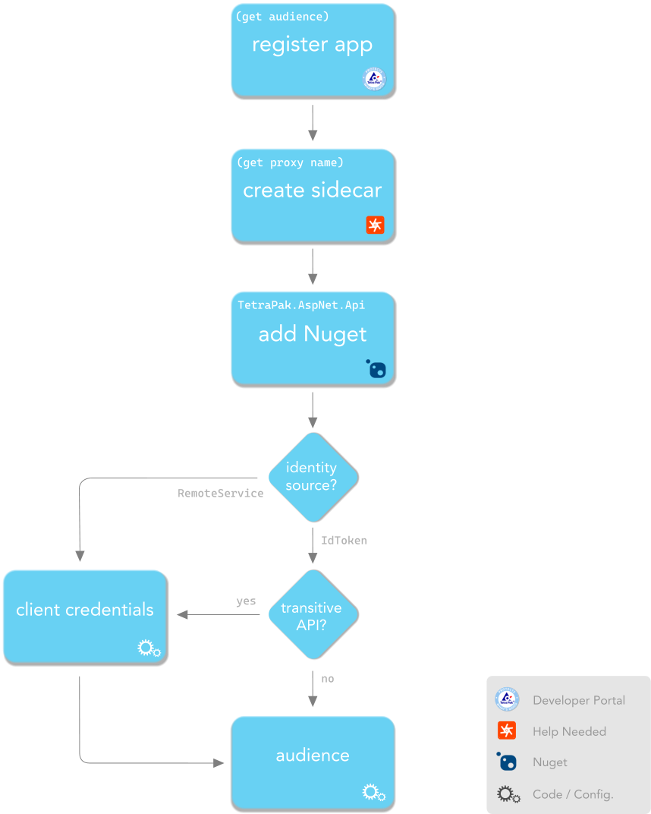

# TetraPak.AspNet.Api - Web API Cheat Sheet

This is the fast-track to get your web app integrated with Tetra Pak Auth Services with minimum fuzz. 

---

*NOTE*

*If you need a better overview and some in-depth then please check out the [README document][tetra-pak-aspnet-api-readme]. There is also a [nice recipe][md-recipe-tetra-pak-aspnet-api] where you are walked through building a simple web API and integrating it with the Tetra Pak Auth Services.*

---



## Register your app in the Tetra Pak Developer Portal

1. Browse to the [Tetra Pak Developer Portal][tp-dev-portal]  and log in (for development/test purposes instead browse to the ["test" Developer Portal][tp-dev-portal-test])
2. Click the "Apps" menu item in the top of the page
3. Click the "Add app" command (upper left part of page)
4. Give your app a name and supply a short description of it.
5. If necessary, specify your callback URL 

    > This is *always* necessary for local debugging (e.g. https://localhost:5001/auth-callback)

6. If [Transitive API][cat-transitive-api] OR you need user [identity][cat-identity] from [`RemoteService`][code-TetraPakIdentitySource]:
   
   1.  Obtain (and securely store) [Consumer Key][cat-client-credentials] (a.k.a. "[client id][cat-client-credentials]") 
   2.  Obtain (and securely store) [Consumer Secret][cat-client-credentials] (a.k.a. "[client secret][cat-client-credentials]").
   
7. Ask for a [sidecar][cat-sidecar] (proxy) from [API manager][cat-api-manager]:
   1. If your are writing a [transitive API][cat-transitive-api] you need to mention your need for [token exchange][cat-token-exchange-flow] as this will affect how your [sidecar][cat-sidecar] gets configured.
   2. You will have to agree on an [audience][cat-audience] for the [JWT Bearer Assertion][tetra-pak-aspnet-api-jwt-bearer-assertion] flow to work. negotiate a suitable audience identifier for your proxy.
   3. When you get the `sidecar name` and `audience`, note them down for later.

## Configure your API

When coding/configuring the [TPAS][cat-tpas] integration you might have a need to supply your [client credentials][cat-client-credentials]. This happens when you are writing a [transitive API][cat-transitive-api], which includes a need for full [identity][cat-identity], obtained from a [`RemoteService`][code-TetraPakIdentitySource-RemoteService]. For this you will need to provide your [client credentials][cat-client-credentials].

8. **[optional]** Configure/code [client credentials][cat-client-credentials] provision. For this you have two options:
   
   1. Secure store and DI service (recommended)

      Persist [client credentials][cat-client-credentials] in a secure store. Then implement [`ITetraPakSecretsProvider`][code-ITetraPakSecretsProvider] interface and configure it as a service. See [Configuring secrets][sc-configuring-secrets]

   2. Configuration (not recommended)
   
      In the `appsettings.json`; add `"TetraPak"` configuration section and paste in the [client credentials][cat-client-credentials]:

      ```json
      {
          "TetraPak": {
            "ClientId": "(consumer key)",
            "ClientSecret": "(consumer secret)"
          }
      }
      ```
    
    > CAUTION!
    > 
    > If you go with option 2 (above) and add the [client secret][cat-client-credentials] to the appsettings you ***must*** ensure the affected `appsettings` file(s) never gets distributed anywhere outside your team. This means the file must not be uploaded to your code repository, for example. 
    > 
    > [Please read more here][tetra-pak-aspnet-scenarios-secrets]

9. Add a `"JwtBearerAssertion"` sub section to configure [JWT Bearer Assertion][cat-jwt-bearer-assertion] (ensuring *only* the sidecar can make requests to your [protected endpoints][cat-protected-controllers-and-endpoints]). The sub section needs to include the expected audience:

    ```json
    {
      "TetraPak": {
        "JwtBearerAssertion": {
          "Audience": "(audience)"
        }
      }
    }
    ```

10. **[optional]** To enable IDE debugging on your desktop (on `localhost`) add a [DevProxy][cat-devproxy] to the `"JwtBearerAssertion"` section (this is the name of the [sidecar][cat-sidecar] you noted in step 7):    

    ```json
    {
      "TetraPak": {
        "JwtBearerAssertion": {
          "Audience": "(audience)",
          "DevProxy": "(sidecar name)"
        }
      }
    }
    ```

    > Just stating the `DevProxy` name is the preferred (and most resilient) method of enabling the `DevProxy` but you can also specify the full URL if needed. 

## Add Tetra Pak authentication to Startup.cs

11. In your web app project; open the `Startup.cs` file
    
12. Add this line anywhere in the `Startup.ConfigureServices` method to enable Tetra Pak [JWT bearer assertion][cat-jwt-bearer-assertion]:
    
    ```c#
    services.AddTetraPakJwtBearerAssertion();    
    ```
    
13. In the `Startup.Configure` method; ensure these middleware exists in this order:

    ```c#
    app.UseRouting();        // <-- necessary

    app.UseTetraPakDiagnostics(env);       // <-- [optional] allows diagnostics, such as profiling headers
    app.UseTetraPakApiAuthentication(env); // <-- add _after_ UseRouting and _before_ UseAuthorization

    app.UseAuthorization();  // <-- necessary
    ```


[tetra-pak-aspnet-api-readme]: ../README.md
[md-recipe-tetra-pak-aspnet-api]: ./Recipe-WebApi.md
[tetra-pak-aspnet-scenarios-secrets]: ../../Scenarios.md#configuring-secrets

[github-tetrapak-app]: https://github.com/Tetra-Pak-APIs/TetraPak.AspNet/tree/master/TetraPak.AspNet
[nuget-tetrapak-app]: https://www.nuget.org/packages/TetraPak.AspNet
[github-tetrapak-api]: https://github.com/Tetra-Pak-APIs/TetraPak.AspNet/tree/master/TetraPak.AspNet.Api
[nuget-tetrapak-api]: https://www.nuget.org/packages/TetraPak.AspNet.Api
[github-tetrapak-common]: https://github.com/Tetra-Pak-APIs/TetraPak.Common
[nuget-tetrapak-common]: https://www.nuget.org/packages/TetraPak.Common
[demo.web-app]: https://github.com/Tetra-Pak-APIs/TetraPak.AspNet/tree/master/demo.WebApp
[di-intro-1]: https://medium.com/flawless-app-stories/dependency-injection-for-dummies-168dad181a3d
[di-intro-2]: https://www.freecodecamp.org/news/a-quick-intro-to-dependency-injection-what-it-is-and-when-to-use-it-7578c84fa88f/
[middleware]: https://docs.microsoft.com/en-us/aspnet/core/fundamentals/middleware/?view=aspnetcore-5.0
[oauth-refresh-flow]: https://datatracker.ietf.org/doc/html/rfc6749#section-1.5
[aspnet-core-configuration]: https://docs.microsoft.com/en-us/aspnet/core/fundamentals/configuration/?view=aspnetcore-5.0

[tp-dev-portal]: https://developer.tetrapak.com
[tp-dev-portal-test]: https://developer-test.tetrapak.com
[tp-dev-portal-appreg-consumer-key]: https://developer.tetrapak.com/products/getting-started/manage-your-app#consumer-key
[tetra-pak-dev-portal-appreg-callback]: https://developer.tetrapak.com/products/getting-started/manage-your-app#callback-url

[hsts]: https://en.wikipedia.org/wiki/HTTP_Strict_Transport_Security
[aspnet-layout]: https://docs.microsoft.com/en-us/aspnet/core/mvc/views/layout?view=aspnetcore-5.0
[aspnet-authorize-attribute]: https://docs.microsoft.com/en-us/aspnet/core/security/authorization/simple?view=aspnetcore-5.0
[aspnet-razor]: https://docs.microsoft.com/en-us/aspnet/web-pages/overview/getting-started/introducing-razor-syntax-c

[code-TetraPakIdentitySource-RemoteService]: ../../TetraPak.AspNet/_docs/_code/TetraPak_AspNet_Auth_TetraPakIdentitySource.md
[code-TetraPakIdentitySource]: ../../TetraPak.AspNet/_docs/_code/TetraPak_AspNet_Auth_TetraPakIdentitySource.md
[code-ITetraPakSecretsProvider]: https://github.com/Tetra-Pak-APIs/TetraPak.Common/blob/master/TetraPak.Common/_docs/_code/TetraPak_SecretsManagement_ITetraPakSecretsProvider.md

[cat-api]: ../../CAT.md#api
[cat-api-manager]: ../../CAT.md#api-manager
[cat-audience]: ../../CAT.md#audience
[cat-client-credentials]: ../../CAT.md#client-credentials
[cat-devproxy]: ../../CAT.md#development-proxy
[cat-identity]: ../../CAT.md#identity
[cat-jwt-bearer-assertion]: ../../CAT.md#jwt-bearer-assertion
[cat-protected-controllers-and-endpoints]: ../../CAT.md#protected-controllers-and-endpoints-aspnet
[cat-sidecar]: ../../CAT.md#sidecar
[cat-tpas]: ../../CAT.md#tpas
[cat-token-exchange-flow]: ../../CAT.md#token-exchange-oauth-flow
[cat-transitive-api]: ../../CAT.md#transitive-api

[sc-configuring-secrets]: ../../Scenarios.md#configuring-secrets
