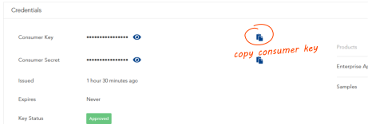

# Recipe: Building a Tetra Pak Web App

This document will walk you through creating a small ASP.NET Core/5+ web app and integrate it with the Tetra Pak Auth Services. After completion you should have a good understanding of how to integrate an existing web app as well. 

The web app will constist of a single view (web page) that will greet the user with his/her name and identity. The page will also present the access token issued by Tetra Pak. 

>*If you need an overview and some background then please check out the [README document][tetra-pak-aspnet-readme]. If you already know everything and just need the fast-track to integrating your existing web app then there is also a neat [cheat sheet][tetra-pak-aspnet-cheat-sheet] (yes, that rhymes :-). Finally, for many issues there is a small [troubleshooting document][tetra-pak-aspnet-issues] that might help you out*

### Disclaimer

This recipe assumes you know how to code C# in your preferred IDE (integrated development environment) whether it is [Visual Studio][ide-vs], [VS Code][ide-vscode], [Rider][ide-rider], [Eclipse][ide-eclipse] etc. We will not cover the nitty gritty of each step required to create a new project, add/restore Nuget packages and so on. You are expected to know these things.

In "real" projects you would probably prefer to base all views on one or more common [(Razor) layouts][aspnet-layout] for UI consistency and less workload. Likewise, your view model design would very likely involve more mature design patters to support separation of concern principles, such as abstractions and/or inheritance. However, in order to keep the recipe as clean and simple as possible we will create a single (non-templated) view and a single view model class. Yes, it's bad design but we're stressing clarity over design purity here.

This recipe also do not include proper error handling, such as redirecting a failed authorization to some nice error page or such. If anything goes wrong you will see a very "raw" error message in your browser.

Finally, the recipe is not concerned with any type of styling or such.

To summarize: It won't be pretty but, hopefully, it will be clear and simple to understand instead! :-)

### Creating a web app (ASP.NET Core / ASP.NET 5+)

For sake of convenience the project will be called "TetraPakWebApp".

Create a ASP.NET Web App project, name it "`TetraPakWebApp`". Please pick a suitable project template if possible that scaffolds at least one controller and view. If your IDE doesn't support that then don't worry, the recipe will outline those for you. For the sake of this recipe we will assume the default view controller is called "`HomeController`" and that is has a corresponding view, called "`Home`". 

Furthermore, create a sub folder called "`Models`" (if one wasn't created for you) and add a C# class file called "`ViewModel.cs`" to it. 

This is what the folder/file structure should look like as a minimum (your IDE's project template might have added more files - that's ok). If the files and folders wasn't created by your IDE then please create them like this:

```
+-- TetraPakWebApp
    |
    +-- Controllers
    |   |
    |   +-- HomeController.cs
    |
    +-- Models
    |   |
    |   +-- ViewModel.cs
    |
    +-- Views
    |   |
    |   +-- Home
    |       |
    |       +-- Index.cshtml
    |
    +-- appsettings.js
    +-- Program.cs
    +-- Startup.cs
```

Before we start coding you first need to add the SDK's Nuget package [TetraPak.AspNet][nuget-tetrapak-app] as there will be one or two extension methods in our code that requires it. The way you do this varies from one IDE to another so we won't cover that in detail.

Now, lets look at the contents of each file, starting with the `HomeController` and work our way down:

```c#
// ./Controllers/HomeController.cs

using Microsoft.AspNetCore.Authorization;
using Microsoft.AspNetCore.Mvc;
using System.Threading.Tasks;
using TetraPak.AspNet;
using TetraPakWebApp.Models;

namespace TetraPakWebApp.Controllers
{
    public class HomeController : Controller
    {
        [Authorize]
        public async Task<IActionResult> Index()
        {
            var accessToken = await this.GetAccessTokenAsync();
            return View(new ViewModel(
                "Tetra Pak Demo",
                User.Identity, 
                accessToken));
        }
    }
}
```

The controller consists of a single endpoint - `Index()` - which is decorated by the [Authorize][aspnet-authorize-attribute] attribute, forcing the user to the authorized before access to this endpoint is granted. 

>*Please note that by the time the app reaches this point the user has already been successfully authorized by Tetra Pak. This all happens in the "request/response middleware" which is not yet set up (we'll get to that shortly). Should authorization fail for some reason you will instead see a raw error message.*

The method now simply acquires the access token issued by Tetra Pak and delegates the view rendering to its `View`, sending an instance of the `ViewModel` needed by that views presentation logic. Let's look at the `ViewModel` next:

```c#
// Models/ViewModel.cs

using System.Security.Claims;
using System.Security.Principal;
using TetraPak;
using TetraPak.AspNet;

namespace TetraPakWebApp.Models
{
    public class ViewModel
    {
        readonly IIdentity _identity;
        
        public string Title { get; }

        public ActorToken AccessToken { get; }

        ClaimsIdentity ClaimsIdentity => _identity as ClaimsIdentity;
        
        public string UserName => _identity?.Name;

        public string FirstName => ClaimsIdentity?.FirstName();

        public string LastName => ClaimsIdentity?.LastName();

        public ViewModel(string title, IIdentity identity, ActorToken accessToken) 
        {
            Title = title;
            _identity = identity;
            AccessToken = accessToken;
        }
    }
}

```

Nothing too fancy here. The view model ctor (constructor) accepts an title for the view, an identity (`IIdentity`), and an access token (`ActorToken`). The properties `UserName`, `FirstName` and `LastName` all relies on the identity.

Let's finish the presentation side of things by suggesting a view before we look into integrating it all with Tetra Pak's Auth Services:

```html
<!-- Views/Home/Index.cshtml -->

@model TetraPakWebApp.Models.ViewModel

@functions {

    string greeting(string prefix)
    {
        return Model.FirstName is null ? $"{prefix} stranger!" : $"{prefix} {Model.FirstName}!";
    }
    
    string userId()
    {
        return Model.UserName;
    }

    string userDetails()
    {
        return Model.FirstName is null ? string.Empty : $"({Model.FirstName} {Model.LastName})";
    }

    string accessToken()
    {
        return Model.AccessToken ?? "(none)";
    }
}

<!DOCTYPE html>
<html lang="en">
<head>
    <meta charset="utf-8"/>
    <meta name="viewport" content="width=device-width, initial-scale=1.0"/>
    <title>@ViewData["Title"] - demo.WebApp</title>
</head>
<body>

<div class="container">
    <main role="main">
    <h1>@greeting("Hello")</h1>
    <p>If you can read this you have successfully integrated with the Tetra Pak Login API!</p>
    <p>USER: @userId() @userDetails()</p>
    <p>ACCESS TOKEN: @accessToken()</p>
    </main>
</div>

</body>
```

The view is a simple [Razor][aspnet-razor] view that renders a very raw presentation from the values provided by the `ViewModel` instance passed to it. We won't dive into how Razor works however. If you need more details [start reading up on Razor here][aspnet-razor].

We will now have a look into one more file - `Startup.cs` - to ensure the web app is set up to route all requests to controllers. For most project templates this is probably the case but if you used some "simpler" IDE, such as VS Code, then you might have to make a few adjustments. 

Please open the `Startup.cs` file and have a look in the `ConfigureServices` method. This method must configure the DI to support controllers with views, like so:

```c#
public void ConfigureServices(IServiceCollection services)
{
    services.AddControllersWithViews();
}
```

> *There might be more code in the `ConfigureServices` method. That's ok but please ensure the above statement is one of them.*

Next, we need to ensure routing is supported and that endpoints are directed to actual controllers. Please move on to the `Configure` method and ...

- Ensure this line is included: `app.UseRouting();`
- Ensure that this statement is there *after* `app.UseRouting();`: 
  ```c#
  app.UseEndpoints(endpoints =>
  {
      endpoints.MapControllerRoute(
          name: "default",
          pattern: "{controller=Home}/{action=Index}/{id?}");
  });
  ```

Depending on the project template used the `app.UseEndpoints` might have already been added. If so, please ensure its argument is identical to the above. This is what sets up the rules for how the routing mechanism resolves endpoints in controller.

For clarity's sake, this is what the `Startup.cs` can look like, as a minimum of what is needed:

```c#
using Microsoft.AspNetCore.Builder;
using Microsoft.AspNetCore.Hosting;
using Microsoft.Extensions.DependencyInjection;
using Microsoft.Extensions.Hosting;

namespace TetraPakWebApp
{
    public class Startup
    {
        public void ConfigureServices(IServiceCollection services)
        {
            services.AddControllersWithViews();
        }

        public void Configure(IApplicationBuilder app, IWebHostEnvironment env)
        {
            if (env.IsDevelopment())
            {
                app.UseDeveloperExceptionPage();
            }

            app.UseRouting();

            app.UseEndpoints(endpoints =>
            {
                endpoints.MapControllerRoute(
                    name: "default",
                    pattern: "{controller=Home}/{action=Index}/{id?}");
            });
        }
    }
}
```

To summarize so far, we have created a very plain ASP.NET Core/5+ web app and protected its single endpoint. 

### Run the app

Go ahead and run your app to make sure the code works. A browser window should now open and load the default page ("/" or "/index"). As the app is not yet integrated with Tetra Pak Auth Services and there is no authentication scheme set up so you will very likely see an error about the fact there is no authentication scheme specified or something similar.

<a id="#save-local-url"></a>
Either way, please make note of, or copy, the host name and port (eg. "https://localhost:8080"). This will be useful shortly.

>*If nothing at all happens then please check out these [troubleshooting tips][tetra-pak-aspnet-issues-no-browser]*

So, with a basic web app done, let's move on to the interesting part: Integrating your Web App with Tetra Pak Auth Services. This involves two steps:

- Register your app with Tetra Pak
- Integrating your app to authenticate with Tetra Pak Auth Services

### Register your App in Developer portal

For any app to integrate with the Tetra Pak Auth Services it needs to be recognized by Tetra Pak. This is done by simply registering the app, with a name and unique "consumer key" (a.k.a. "client id" or "API key"). You do this in the Tetra Pak Developer Portal like so:

1. Open a browser and navigate to the [Tetra Pak developer portal][tetra-pak-dev-test-portal]


>*This instruction assumes you are starting out with a DEV (Development) environment. For PROD (Production) please use the [Production development portal][tetra-pak-dev-portal].*


2. Log in
3. Click the "Apps" menu item at the top of the page
4. Click the "Add app" command (upper left part of page)
5. Give your app a name and supply a short description of it
6. Specify the Callback URL (from [this step](#save-local-url)). The default callback path for this SDK is `/auth-callback`. So, for example, if your local host is `https://localhost:8080` then the Callback URL should be `https://localhost:8080/auth-callback`
   
   > *Please note that this value can be edited later if you return to your app registration and select the "Edit" tab (will be visible once you save your app registration). If you are unsure at this time which port you'll be using locally then just change this value later, when you know the full callback URL. [For more information please go here][tetra-pak-dev-portal-appreg-callback].*
   
7. In a "real" web app you would probably want to consume one or more API products. For this recipe that is not the case. However, please double check that the "`Enterprise Application Security`" service is already selected, or select it otherwise. This service is critical for integrating with the Tetra Pak Auth Services. You might have to scroll down to see it

8. Scroll down to the end of the page and click "ADD APP"
9. You are now taken to your app overview page, where all your app registrations are listed. Please select the one you just created by clicking it. This should present the App details
10.  From the App details click the "copy" icon next to the "Consumer Key" (you will need this value in the next phase; [Integrating your Web App](#integrating-your-app-to-authenticate-with-tetra-pak)) so please paste it somewhere, or repeat this step to copy it when needed



### Integrating your app to authenticate with Tetra Pak

We can now move on to the final stage: Integrating the web app with Tetra Pak Auth Services to automatically authorize access to protected endpoints. This involves two steps:

- Add two lines of configuration
- Add some code to enable Tetra Pak authentication

Let's begin with the configuration:

1. Open the `appsettings.json` file in an editor
2. Add a new section and name it `"TetraPak"` and paste the consumer key you copied in the previous phase as a named `"ClientId"`:

```json
"TetraPak":  {
    "ClientId": "(paste the consumer key here)"
}
```

This is the minimum amount of configuration needed to successfully integrate your web app with Tetra Pak's Auth Services. 

> *Please note that you can also specify the callback path, such as `"CallbackPath": "/call-me"`. If omitted the full callback URL will take the form `<host>/auth-callback`. So, if you're debugging locally on, say, port `8080` over the `HTTPS` scheme the full callback URL would be: `https://localhost:8080/auth-callback`. Please ensure that the callback path used is the one specified in your [app registration](#register-your-app-in-developer-portal).*

To finish the integration we need some code in two separate methods of the `Startup` class:

3. Open the `Startup.cs` file.
4. Add a `using` statement at the start of the file: `using TetraPak.AspNet.Auth;`
5. In the `ConfigureServices` method, add this line (anywhere in the method):

```c#
services.AddTetraPakOidcAuthentication(); // <-- add this anywhere in method
```

5. In the `Configure` method add this line *after* the `app.UseRouting()` method and *before* the `app.UseAuthorization()` method:

```c#
app.UseAuthentication(); // <-- add this after routing / before authorization
```

6. Please ensure the line `app.UseAuthorization();` is included *after* `app.UseAuthentication();` (add it otherwise)

Just to perform a quick sanity check; this is more or less what those two method should look like if you made no other changes (*there might be more or less code added by the project template you used to create the web app*):

```c#
public void ConfigureServices(IServiceCollection services)
{
    services.AddTetraPakOidcAuthentication(); // <-- add this
    services.AddControllersWithViews();
}

public void Configure(IApplicationBuilder app, IWebHostEnvironment env)
{
    if (env.IsDevelopment())
    {
        app.UseDeveloperExceptionPage();
    }
    else
    {
        app.UseExceptionHandler("/Home/Error");
        app.UseHsts();
    }

    app.UseHttpsRedirection();

    app.UseRouting();        // <-- necessary

    app.UseAuthentication(); // <-- add this

    app.UseAuthorization();  // <-- necessary
}

```

That's it! Try running your app locally ([please ensure you have registered the correct Callback URL](#register-your-app-in-developer-portal)). If you run into trouble, please look into the [Troubleshooting document][tetra-pak-aspnet-issues].


[tetra-pak-aspnet-readme]: ./README.md
[tetra-pak-aspnet-cheat-sheet]: ./cheatsheet-webapp.md
[tetra-pak-aspnet-issues]: ./troubleshooting.md
[tetra-pak-aspnet-issues-no-browser]: ./troubleshooting.md#no-browser
[tetra-pak-aspnet-issues-invalid-redirect-uri]: ./troubleshooting.md#invalid-redirect-uri
[github-tetrapak-app]: https://github.com/Tetra-Pak-APIs/TetraPak.AspNet/tree/master/TetraPak.AspNet
[nuget-tetrapak-app]: https://www.nuget.org/packages/TetraPak.AspNet
[github-tetrapak-api]: https://github.com/Tetra-Pak-APIs/TetraPak.AspNet/tree/master/TetraPak.AspNet.Api
[nuget-tetrapak-api]: https://www.nuget.org/packages/TetraPak.AspNet.Api
[github-tetrapak-common]: https://github.com/Tetra-Pak-APIs/TetraPak.Common
[nuget-tetrapak-common]: https://www.nuget.org/packages/TetraPak.Common
[demo.web-app]: https://github.com/Tetra-Pak-APIs/TetraPak.AspNet/tree/master/demo.WebApp
[di-intro-1]: https://medium.com/flawless-app-stories/dependency-injection-for-dummies-168dad181a3d
[di-intro-2]: https://www.freecodecamp.org/news/a-quick-intro-to-dependency-injection-what-it-is-and-when-to-use-it-7578c84fa88f/
[middleware]: https://docs.microsoft.com/en-us/aspnet/core/fundamentals/middleware/?view=aspnetcore-5.0
[oauth-refresh-flow]: https://datatracker.ietf.org/doc/html/rfc6749#section-1.5
[aspnet-core-configuration]: https://docs.microsoft.com/en-us/aspnet/core/fundamentals/configuration/?view=aspnetcore-5.0
[tetra-pak-dev-test-portal]: https://developer-test.tetrapak.com
[tetra-pak-dev-dev-portal]: https://developer-dev.tetrapak.com
[tetra-pak-dev-portal]: https://developer.tetrapak.com
[tetra-pak-dev-portal-appreg-consumer-key]: https://developer.tetrapak.com/products/getting-started/manage-your-app#consumer-key
[tetra-pak-dev-portal-appreg-callback]: https://developer.tetrapak.com/products/getting-started/manage-your-app#callback-url
[hsts]: https://en.wikipedia.org/wiki/HTTP_Strict_Transport_Security
[aspnet-layout]: https://docs.microsoft.com/en-us/aspnet/core/mvc/views/layout?view=aspnetcore-5.0
[aspnet-authorize-attribute]: https://docs.microsoft.com/en-us/aspnet/core/security/authorization/simple?view=aspnetcore-5.0
[aspnet-razor]: https://docs.microsoft.com/en-us/aspnet/web-pages/overview/getting-started/introducing-razor-syntax-c
[ide-vs]: https://visualstudio.microsoft.com/
[ide-vscode]: https://code.visualstudio.com/
[ide-rider]: https://www.jetbrains.com/rider/
[ide-eclipse]: https://www.eclipse.org/ide/